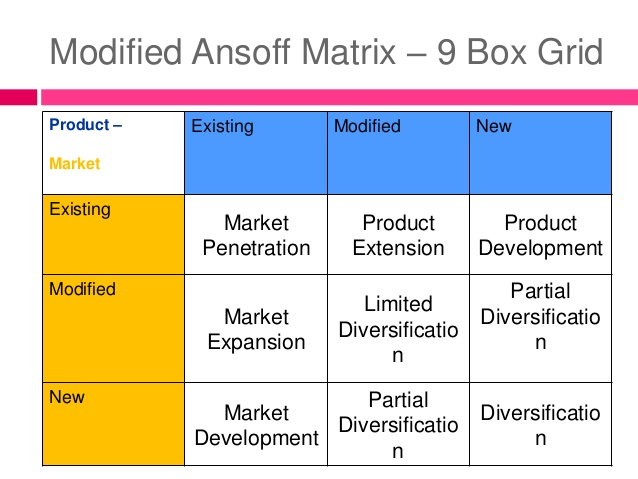

# Introductie organisatiekunde

<div class="border-t-4 border-indigo-dark w-48 mt-4 mb-8"></div>

## Literatuur


- Titel: IT management voor het HBO: Organisatie
- Auteur: Remco Meisner
- ISBN: 978-90-70808-27-3

Het vak IITORG word gegeven op de Hogeschool Leiden door Remco Meisner. Het vak is _Inleiding ogrganisatiekunde_. Na het volgen van dit vak kan de student het volgende:

- verschillende bedrijfskundige modellen uitleggen, verklaren en toepassen
- een organisatie typeren met gebruik van de organisatietypologie van
  Mintzberg en de culturele typologie van Hofstede
- het levencyclusmodel van Greiner uitleggen
- de vijf P's van de marketingmix (product, prijs, plaats, promotie en
  personeel) en de daarbijbehorende theoretische modellen benoemen,
  verklaren en toepasseni
- de BCG-matrix en de PLC uitleggen en toepassen
- de valuechain en het vijfkrachtenmodel van Porter uitleggen en toepassen
- aan de hand van PMC's nieuwe mogelijkheden voor producten en diensten
  benoemen
- verschillende leiderschapsstijlen onderscheiden en benoemen.

De student is in staat om:

- het basiselement prijs in de marketingmix te benoemen en te gebruiken
- het basiselement product uit de marketingmix te benoemen en te gebruiken
- het basiselement promotie uit de marketingmix te benoemen en te gebruiken
- het basiselement plaats uit de marketingmix te benoemen en te gebruiken
- het basiselement personeel uit de marketingmix te benoemen en te
  gebruiken
- diverse bedrijfskundige modellen, mede inzake leiderschapstijlen, te
  benoemen en te hanteren.

# Organisatie, omgeving, leiderschap, cultuur

> Hoofdstuk 3, hoofstuk 6, hoofdstuk 9, hoofstuk 12, hoofdstuk 16, hoofstuk 17, hoofstuk 18

## Organisatie, Missie & visie

### Organisatie

Organisatie is een groep mensen die met technische en financiele middelen activiteiten uitvoeren om een gemeenschappelijk doel te realiseren.

Een aantal "eigenschappen" van een organisatie zijn:

- Mensen
- Gecoordineerd
- Technische en financiele middelen
- Activiteiten
- Gemeenschappelijk doel.

Zowel profit en non profit organisaties zijn organisaties. Een ZZP-bedrijf is ook een non profit organisatie.

### Missie

De missie van de organisatie beschrijft de maatschappelijke behoefte waar de organisatie in voorziet.

- Wie zijn we?
- Wat doen we?
- Wie zijn onze klanten?
- In welke behoeften van klanten voorzien onze producten?

### Visie

Naast de missie is er ook de visie. Die valt te typeren als "visie = missie + principes". Principes hebben betrekking op de normen en waarden van de organisatie bijvoorbeeld:

- De kwaliteit komt eerst.
- De klant komt eerst.

## Omgevingsfactoren


## Indeling organisatie

De indeling van de organisatie kan op verschillende manieren:

- **Lijn organisatie**: iedere medewerker heeft 1 directe baas. De baas heeft een aantal medewerkers. Het aantal medewerkers onder een baas word de **span of control** genoemd.

- **Lijn-staforganisatie**: aanvulling op de lijn organisatie. Hierbij zijn staffuncties die zoals bijvoorbeeld administratie of financien die geen lagen aanstuurt maar een ondersteunende rol heeft voor de organisatie.

- **Functionele organisatie**: de indeling van het bedrijf worden gelijksoortige processen bij elkaar gebracht. Bijv. JAVA-ontwikkelaars, PHP-programmeurs, testers, ontwerpers, verkopers.

- **Geografische organisatiestructuur**: organisatievorm waarbij de uitvoering naar geografische regio is opgedeeld

- **Project gericht**: de organisatie is gericht op een project met projectmangement

- **Matrixorganisatie**: organisatievorm die is opgedeeld naar verschillende gezichtspunten, bijvoorbeeld naar productgroep en naar geografische regio. Een medewerker heeft dan twee bazen, namelijk het hoofd van de productgroep én het hoofd van de geografische regio. In de top dient dan afgesproken te zijn wat de zeggenschap is van ieder van de bazen, welke terreinen die zeggenschap bestrijkt.


## Macht

> Wie macht heeft, is in staat om het gedrag van anderen te sturen.

Wie heeft de 'macht in een organisatie'?

- Hiërarchische macht
- Kennis, toegang tot informatie
- Beslist over verdeling middelen (geld, gereedschap, etc.)
- Populariteit, aanzien, respect, steun van veel anderen
- Fysieke macht (de sterkste)

Politiek

- Machtsspelletjes
- Koninkrijkjes
- Tegenwerking bij verandering
- Tegenwerking

> Reden: “Eigenbelang”

## Redenen van hiërarchie en coördinatie

- Directe supervisie
- Onderlinge afstemming
- Standaardiseren van
  – werkprocessen
  – prestaties en resultaten
  – vaardighedenenkennis
  – normen en waarden, cultuur

- Regels en procedures
- Planning en controle van planning

## Cirkel van falen


## Cirkel van succes


## Leiderschapsstijlen (Quinn)


## Situationeel leiderschap (Hersey)


## Culturele typologie (Hofstede)

Hofstede heeft 5 dimensies bedacht die als graadmeter dienen voor culturele verschillen en die zou moeten helpen bij het overbruggen van deze verschillen tijdens de interculturele communicatie tussen partijen van verschillende culturen.


- **Machtsafstand**: Deze dimensie geeft aan de machtsafstand/ongelijkheid in de cultuur, dit kan zijn tussen ouder en kind, baas en werknemer of man en vrouw.
- **Individualisme vs. collectivisme**: organisaties waarbij ieder individueel werkt en geen of nauwelijks samenhang met de anderen ervaart, ieder hakt voor zichzelf knopen door (individualisme) of organisaties waarbij men in groepen opereert (of als gehele afdeling, of als gehele organisatie) en alleen gezamenlijk knopen doorhakt (collectivisme).
- **Masculiniteit vs. Feminiteit**: organisaties waarbij de macht van de sterkste geldt en men elkaar 'stoer' en 'mannelijk' behandelt, wil wínnen (masculien) of organisaties waarbij men gezamenlijk de dingen onderneemt, elkaar de helpen hand toesteekt en uit is op eenheid (feminiteit).
- **Onzekerheidsvermijding**: organisaties die zekerheden heel belangrijk vinden en niet goed om kunnen gaan met het onverwachte (onzekerheidsvermijding) versus organisaties die veranderingen en het onverwachte volkomen normaal vinden en die daarmee heel goed overweg kunnen (onzekerheidaccepterend).
- **Lange termijn vs. korte termijn**: organisaties die het focus leggen op termijnen van vele jaren of decennia, zoals vaker in bijv. Japan en China aangetroffen wordt (lange termijn) versus organisaties die slechts kort vooruitkijken, bijv. enkele aanden, zoals je dat vaker in bijv. Europa en Noordamerika aantreft.

# Valuechain,Mintzberg,contingentie,levenscyclus

> Hoofstuk 15, hoofdstuk 19, hoofdstuk 20

## Valuechain of porter

Michael Porter ontwikkelde een belangrijk instrument voor het vinden van manieren om meer klantenwaarde te creëren. De valuechain splitst een bedrijf op in negen waardegenererende activiteiten.

Primaire activiteiten:

- inkomende logistiek: afstemming product, aanleveren grondstoffen
- operationele activiteiten: productontwikkeling
- uitgaande logistiek: distributie van resultaten
- marketing en verkoop: marktonderzoek, reclame
- service: klantenservice, garantie, reparatiedienst

Ondersteunende activiteiten:

- infratructuur: begroting, boekhouding
- human resources management/personeel: werving, training
- technologie ontwikkeling: ict voorzieningen
- inkoop: marktonderzoek, verwerving goederen.


## Mintzberg

Mintzberg heeft bepaald dat een organisatie bestaat uit verschillende onderdelen

### Configuraties


- De strategische top (het top-management).
- Het midden management. Deze voert het beleid uit van het top-mangement met in acht nemend de wensen van de operende kern.
- De opererende kern. De mensen die de producten maken of diensten leveren.
- De technische structuur(IT, en logistieke planning).
- De ondersteunende staf (administratie, finance, cafetaria).

---

Mintzberg heeft bepaald dat er 5 configuraties zijn van een organisatie.

#### Ondernemersorganisatie

- meeste macht bij de top
- weinig regels en procedures
- weinig staf, plaate informele organisatie
- familiecultuur
- informatie loopt vooral van en naar de top


---

#### Machineorganisatie

- routinematig
- sterke hierarchie en technostructuur
- veel regels en procedures
- stabiele omgeving
- piramide cultuur


---

#### Professionele organisatie

- hoogopgeleid
- belangrijke rol zelfstandige proffessionals
- grote ondersteunende staf
- technostructuur is beperkt. regels komen vaak van buitenaf
- geoliede machine structuur


---

#### Innovatieve organisatie

- jong flexibel
- projectmatig werken
- onduidelijke taakverdeling
- veel onzekerheid en politiek
- medewerkers hebben vaak laptops met allerlei ‘freeware’


---

#### Gediversificeerde organisatie


- binnen bedrijf onderverdeling naar producten of markten
- belangrijke rol middenkader: aansturing van de divisies

---

#### Kenmerken


#### Componenten en hun belangen

Elke onderdeel van een organisatie heeft zijn eigen belangen.


- _De strategische top_ wilt graag centralizeren. Het belang ligt erbij om de organisatie zoveel mogelijk samen te voegen en optimaal overzicht te houden.
- _Support_ wilt graag de samenwerking bevorderen intern en met externe belanghebbenden.
- _Technische structuur_ wilt graag standaarden. Door internationale standaarden te gebruiken zoals ITIL, ASL of BiSL.
- _De opererende kern_ wilt graag professionalisering. Het steeds beter realiseren van dagelijkse werkzaamheden.
- _Lijn management_ streeft ernaar om te balkaniseren. Ze streven ernaar om verschillende groepen te plezieren.

> Contingentietheorie: Het gedrag van de medewerkers uit zich op een bepaalde manier en dat wordt bijv. ervaren als stimulerend of juist demotiverend. Dit gedrag is het gevolg van wat er in de organisatie is gebeurd. Het staat dus niet op zichzelf.

### Zendings- en politieke organisatie

Een zendings organisatie staat ideologie voorop. Management staat dicht bij de uitvoering. Hierbij kan je denken aan WNF die dieren over heel de wereld helpt. Een politike organisatie draait het om macht. Dit zijn zowel politieke partijen als regeringen.

# Contigentietheorie

Het gedrag van de medewerkers uit zich op een bepaalde manier en dat wordt bijv. ervaren als stimulerend of juist demotiverend. Dit gedrag is het gevolg van wat er in de organisatie is gebeurd. Het staat dus niet op zichzelf.

Voor informatievoorziening zijn de belangrijkste factoren:
– de structuur van het bedrijf
– de cultuur van het bedrijf
– het belang van IT voor het bedrijf
– de fase waarin het gebruik van IT zich bevindt – de automatiseringserfenis

### Levenscyclus van organisatie


# Greiner

> Hoofdstuk 20

Elke organisatie heeft een levenscyclus. Greiner heeft bepaald dat er 6 fasen zijn die elke organisatie doormaakt. Elke fase word afgesloten met een crisis. Organisaties kunnen anticiperen en voorbereiden op de aankomende crisis.


## Fase 1

- Groei door: creativiteit
- Fase: pioniersfase

Pionere, vakmanschap, flexibiliteit, gedrevenheid en informaliteit. Iedereen kent iedereen. Start-ups.

### Crisis 1 - leiderschapscrisis

De leidinggevende is niet veranderd, wel is de organisatie gegroeid waardoor hij of zij niet iedereen meer kan zien, inlichten, horen. Medewerkers krijgen het gevoel dat de leidinggevende minder bereikbaar is voor de medewerkers en veel alleen doet.

## Fase 2

- Groei door: leiding
- Fase: managementfase

Formeel leiderschap, organisatiestructuur, financiele verantwoordingssystemen(bv. budgetten). Hierdoor wordt het leiderschap formeler,decommunicatie formeler, krijgt men een meer onpersoonlijk karakter, de eerste rechterhanden verschijnen. "Vroeger was het beter".

### Crisis 2 - autonomiecrisis

Tijd gaat verloren doordat er door hiërarchische niveaus word gecommuniceerd. Alles gaat nog via de centrale hiërarchie en dit leidt bij de rechterhanden tot frustratie: zij zijn meestal heel goed op de hoogte, maar mogen niets (de sandwichfunctie).

_Er is roep naar meer autonomie_

## Fase 3

- Groei door: delegatie
- Fase: decentralisatiefase

Een delegatie van verantwoordelijkheden, middenmanagement krijgt duidelijke taken en verantwoordelijkheden, een eigen motivatiesysteem, management/ bedrijfsleiding grijpt enkel in waar echt nodig (management by exception). kleinere teams, ieder team krijgt meer vrijheidsgraden

### Crisis 3 - beheer crisis

teams ondernemen actie, verbeteren, veranderen, maar allemaal wat los van elkaar, zonder algemene lijn. Het management heeft moeite om het te overzien. Het management reageert hier op door te centraliseren maar het bedrijf is te groot geworden hiervoor.

## Fase 4

- Groei door: coordinatie
- Fase: standaardisatiefase

De introductie van betere coördinatiesystemen: men stemt het werk van afdelingen meer op elkaar af. Meer standaarden. Meer planning.

### Crisis 4 - bureaucratiecrisis

De complexe en grote structuur die men tracht werkbaar te houden door een groot geheel aan regels en procedures. Men rijdt zich vervolgens vast in deze berg bureaucratie

## Fase 5

- Groei door: samenwerking
- Fase: samenwerkingsfase

De uitbouw van interpersoonlijke samenwerkings-verbanden

### Crisis 5 - overlegcrisis

Door een samenwerking tussen de verschillende afdelingen vinden veel overlegmomenten plaats, om alle activiteiten op elkaar af te stemmen. Deze overlegmomenten zijn tijdrovend, hierdoor ontstaat een overlegcrisis.

## Fase 6

- Groei door: ondernemen
- Fase: ondernermerfase

Medewerkers worden geacht ondernemers te worden die zelf initiatieven nemen.

### Crisis 6 - identiteitscrisis

Door eenzijdige nadruk op resultaten voelen mensen zich een nummer en ontstaat een ‘sociale identiteitscrisis’

## Vierfasen model van Hardjono

Het model van Hardjono word gebruikt om de huidige organisatie te analyseren en vast te stellen wat de organisatorische controlepunten zijn en welke interventies gepleegd moeten worden in lijn met de strategie.
Er zijn van 4 verschillende cirkels. Van binnen naar buiten zijn dit:

- Materieel
- Commercieel
- Sociaal
- Intellectueel

Organisaties kunnen hun doelstellingen bereiken door te kiezen voor een bepaalde oriëntatie: intern of extern, en control (beheersing) of verandering. Het is niet mogelijk alle oriëntaties tegelijk evenveel aandacht te geven, maar combinaties van niet-tegengestelde oriëntaties zijn wel mogelijk. Zo ontstaan vier mogelijke strategische keuzes:

- Innovatie
- Markt
- Productie
- Lean

In het ideale geval zou een organisatie doelstellingen hanteren voor alle vier de keuzes: effectiviteit, efficiency, flexibiliteit en creativiteit. Organisatie-ontwikkeling kenmerkt zich echter juist door het feit dat gedurende een bepaalde tijd de nadruk ligt op één van de vier keuzes en de overige drie minder aandacht krijgen. Er is volgens Hardjono bovendien een ideale volgorde van die vier keuzes die ontwikkelingsfasen vormen (vandaar de benaming ‘vierfasenmodel’):

- Het idee (_innovatie_)
- Vermarkten (_markt_)
- Organisatie (_productie_)
- Herorientatie (_lean_)


# Rechtsvormen,PMC,BCG,PLC,Leeflang,Copeland

> Hoofdstuk 9, hoofstuk 21, hoofdstuk 22, hoofstuk 24

## Rechtsvormen

### Eenmanszaak

Waarbij één persoon in alle opzichten verantwoordelijk is voor de onderneming. Al betreft de bedrijfsvorm een eenmanszaak, kan deze wel personeel in dienst hebben.

### Venootschap onder Firma \(V.o.f\)

De leden van een VOF \(vennoten\) zijn ieder geheel aansprakelijk voor de schulden van de vennootschap, dus ook voor schulden die een mede-vennoot heeft gemaakt. Het betekent in feite dat zij onder een gezamenlijke naam of firma optreden

### Besloten venoottschap

Aandelen van de organisatie staan op naam.

### Naamloze vennootschap

Aandelen zijn vrij overdraagbaar.

### Commanditaire vennootschap

In deze vennootschapsvorm zijn er één of meer beherende vennoten en één of meer stille vennoten. Deze laatste hebben slechts een financiële inbreng en worden ook wel commanditaire vennoten genoemd. De beherende vennoot is dan de gecommanditeerde vennoot, hij die bevoegd is om te handelen namens de vennootschap.

### Vereniging

Een vereniging is een verzameling mensen die zich met een bepaald doel georganiseerd heeft.

### Stichting

Een stichting is een organisatie die erop gericht is een bepaald doel te verwezenlijken. Een stichting mag winst maken, maar de uitkering hiervan moet een ideële of sociale strekking hebben.

### Maatschap

Waarbij twee of meer personen of rechtspersonen \(de vennoten of maten\) een bepaalde samenwerking aangaan. De vennoten brengen iets in, met het doel het voordeel dat daaruit voortvloeit te delen. Ze kunnen arbeid, geld, goederen of goodwill inbrengen. De onderlinge afspraken worden vastgelegd in een maatschapscontract. Bij een maatschap zijn de leden \(maten\) ieder voor een gelijk deel aansprakelijk voor de schulden van de maatschap.

## PMC \(Ansoff\)

**Product-Markt combinatie**

Het Ansoff-model is een strategisch hulpmiddel bij het formuleren van groeistrategieën. Door twee belangrijke strategieën aan elkaar te relateren \(product/portfolio en concurrentie/markt\) kan er op een logische manier nagedacht worden over de strategische ontwikkeling van een bedrijf in een markt.


- Market Penetration: een bestaand product op een bestaande markt vereist dieper in de markt door te dringen dmv bv reclame
- Market Development: een bestaand product op een nieuwe markt vereist introductie van het product en behoefte worden gecreerd
- Product Development: een nieuw product op een bestaande markt, product moet aansluiten bij de behoeften van de bekende markt.
- Diversification: een nieuw product op een nieuwe markt. het is een uitbreiding van het bestaande producten pakket



## BCG Matrix

De BCG-matrix is een vervolg van het model van Ansoff. De BCG-matrix verbindt de marktgroei of het marktpotentieel aan het marktaandeel.


Het model illustreert dat een product/dienst een bepaalde ontwikkeling probeert door te maken. Het model illustreert hoe een product zich kan gunstig of ongunstig kan ontwikkelen.

- vraagteken: marktaandeel = **klein**, marktgroei = **groot**, het is onduidelijk hoe het product hoe het product zich ontwikkeld.
- ster: marktaandeel = **groot**, marktgroei = **groot**, het product lijkt marktaandeel te veroveren maar tot welke hoogte is onduidelijk.
- koe: marktaandeel = **groot**, marktgroei = **klein**, de marktvraag neemt af door verzadeging of concurrentie. door het aandeel in de markt levert het geld op maar de groei is eruit.
- hond: marktaandeel = **klein**, marktgroei = **klein**, als het vraagteken product niet aanslaat is word het een hond. als een koe niet langer in trek is word het ook een hond.

## Product Life Cycle


Een product maakt de volgende fase door:

- development
- introductie
- groei
- volwassenheid
- neergang

Het beste moment om een nieuwe product te introduceren is in de growth fase. In die fase komt er goed geld binnen en is er genoeg om een nieuwe product te ontwikkelen zonder investeerder.s

### BCG en PLC

De BCG matrix en PLC \(Product Life Cycle\) vullen elkaar goed aan. De **development** fase van de PLC sluit aan bij **vraagteken** van de BCG. Wanneer de **introductie** fase van de PLC heeft plaatsgevonden word het product een **ster** in de BCG. Dit blijft gedurende de **growth** fase van de PLC. Uiteindelijk bereikt het **maturity** en op dat moment is het **koe**. Als laatste bereikt het de **decline** fase en op date moment is het een **dog**.

|     PLC      |    BCG     |
| :----------: | :--------: |
| development  | vraagteken |
| introduction |    ster    |
|    growth    |    ster    |
|   maturity   |    koe     |
|   decline    |    dog     |

## Adoptiecurve van Rogers


1. Innovators - zijn het meest bereid om nieuwe producten aan te schaffen voordat ze algemeen geaccepteerd zijn. Cruciaal bij het starten van een trend
2. Early adopters - zijn er snel bij. Houd trends in de gaten en volgt de nieuwste trends.
3. Early majority - zij zien het als een mogelijkheid om concurrentievoordeel te behalen of bestendigen
4. Late majority - ziet het als noodzaak maar heeft er niet zoveel mee
5. Laggards - verzetten zich tegen de meeste vormen van vernieuwing. Gaan overstag door externe druk.

### Adoptiecurve en PLC

Tijdens de **development** fase van de PLC zijn het uitsluitend de _innovators_ geinteresseerd. In de **introduction** fase komen daarbij de _early adopters_. Tijdens de **introductie** en de **growth** fase komen daarbij de _early majority_ en het begin van de _late majority_. Tijdens de **maturity** komen daarbij het tweede deel van de _late majority_. Tijdens de decline komt daar het laatste deel van de _late majority_ bij en uiteindelijk _laggards_.

|     PLC      |          Adoptiecurve          |
| :----------: | :----------------------------: |
| development  |           innovators           |
| introduction | early adopters, early majority |
|    growth    | early majority, late majority  |
|   maturity   |         late majority          |
|   decline    |    late majority, laggards     |

### Adoptiecurve en BCG

De _innovators_ spelen een rol tijdens de **vraagteken** van de BCG-matrix. De _early adopters_ en _early majority_ zijn bepalend voor de **star**. De _late majority_ doet mee tijdens de **cow fase** en uiteindelijk de laggards in de **dog** fase.

|  Adoptiecurve  |    BCG     |
| :------------: | :--------: |
|   innovators   | vraagteken |
| early adopters |    star    |
| early majority |    star    |
| late majority  |    cow     |
|    laggards    |    dog     |

## Dienst

Een dienst is:

- Afnemer werkt mee
- Bestaat nog niet bij koop
- Persoonlijk
- Geen zekerheid •Mensenwerk

## Product

Een product is:

- tastbaar
- heeft \(meestal\) een voorraad
- garantie
- \(meestal\) vaste prijs.

## Productsamenstelling \(Leeflang\)


- het fysiek product: Het kale product, dit zijn de functionele en esthetische kenmerken zoals afmetingen en kleur.
- het uitgebreide product: Het fysiek product, met toegevoegde eigenschappen. Zoals, verpakking, merknaam, service en garantie.
- het totale product: Het uitgebreid product, maar dan met toegevoegde emotionele, instrumentele en expressieve eigenschappen/waarden door de consument toegevoegd!

## Productsamenstelling \(Copeland\)


**Convenience goods:**

> zonder na te denken of enige inspanning gekocht, meestal producten met een lage waarde per eenheid

- impulsgoederen \(zonder na te denken of inspanning gekocht. Bijvoorbeeld albert heijn bij de kassa of tankstation\).
- stapelgoederen \(dagelijks gebruik\)
- emergency goederen \(bijv. een gloeilamp\).

**Shopping goods**

> Producten worden gekocht na een duidelijk en bewust onderzoek. \(bijvoorbeeld kleding\)

- Kleding
- Laptop
- PC

**Speciality goods**

> Een consument doet zeer veel moeite voor dit product, bijvoorbeeld voor een bepaalde parfum naar Parijs.

- Auto
- Huis

**Unsought goods**

> Consumenten weten nog niet van het bestaan af van het product, er bestaan ook regular unsought goods. Hiervan kent men wel het bestaan maar, deze goederen wenst men nog niet.

- Uitvaartpolis
- Verzekeringen

## Productensamenhang

- Substitutie goederen
- Indifferente goederen
- Complementaire goederen

## Producten naar inkomen

- Inferieure producten is een goed waarvan de consument minder gaat kopen als zijn inkomen stijgt en waarvan hij meer gaat kopen als zijn inkomen daalt
- Noodzakelijke producten
- Luxe producten zijn goederen die niet direct in de eerste levensbehoefte van de consument voorzien, maar waaraan de consument wel een zeker nut onttrekt.

## Merk

Een merk is een naam, beeld, symbool om het product te onderscheiden van concurrerende producten.

## Trading up

Toevoeging aan het assortiment van een of meer producten met een hoger gewaardeerde prijs/ kwaliteitverhouding

## Trading down

Toevoeging aan het assortiment van een of meer producten met een lager gewaardeerde prijs/ kwaliteitverhouding

# Promotie,plaats,distributieenkanalen

## Promotie

> Promotie is het onder de aandacht brengen van een nieuw of bestaand product of service met als doel de omzet positief te beïnvloeden.

Onder promotie vallen onder andere:

- Reclame
- PR
- Promotions van product/dienst

### Reclame

> Reclame is overredende commerciele communicatie over producten en organisaties waarbij tegen betaling gebruik wordt gemaakt van massamedia en waarvan het doel is de kennis en attitude en waar mogelijk het gedrag van de doelgroep in een voor de adverteerder gunstige richting te beinvloeden.

Een aantal reclame technieken zijn:

- Herhaling: Om te zorgen dat hun product of merk goed herkend wordt, gebruiken veel reclamemakers herhaling. Een goed voorbeeld hiervan zijn de herhalingen binnen hetzelfde reclameblok. De hoeveelheid herhaling wordt vaak als reclamedruk omschreven.
- Groepsgeest: Door te impliceren dat al veel mensen het product gebruiken, spelen de reclamemakers zowel in op het gevoel 'erbij te willen horen', als op de vermeende risicoreductie die hiervan uit gaat.
- Getuigenissen: Om de superieure kwaliteit van hun product aan te tonen, gebruiken reclamemakers verklaringen van gewone gebruikers, experts of allebei. Ook worden hiervoor bekende personen gebruikt. In het reclamejargon wordt hiervoor de Engelse term testimonials gebruikt.
- Actiegeoriënteerd: Door mensen onder druk zetten om snel te kiezen zonder al te veel bedenktijd hopen reclamemakers impulsaankopen te genereren.
- Associatie: Reclamemakers proberen hun product te associëren met aangename of begeerlijke dingen (bijvoorbeeld bij erotisatie) om hun eigen product even begerig te maken. Hiervoor gebruiken ze modellen, landschappen en ander vergelijkbaar beeldmateriaal.
- Slogans: faciliteert de herinnering aan het aanbod.
- Cognitieve stijl: Techniek om mensen op een of meerdere van hun mentale denkstijlen aan te spreken: logisch; pragmatisch; emotioneel of creatief.
- Aspirationele leeftijd: Door de boodschap te richten op de aspirationele leeftijd van de doelgroep, wordt deze voor de daadwerkelijke doelgroep aantrekkelijker.
- Teasing: Een techniek waarbij de reclamemakers de nieuwsgierigheid van de consument willen prikkelen, vaak door het geven van een voorproefje: ze doen de consument gissen of verlangen naar het eigenlijke product dat achter de advertentie zit. Deze techniek werkt vaak met symbolen. De teaser is extra effectief als deze tot nadenken aanzet.
- Buzzen: Door een zogenaamde buzzer een artikel te laten uitproberen, kan deze in zijn omgeving voor mond-tot-mond-reclame zorgen. Zeker bij nieuwe artikelen kan dit snel voor goede naamsbekendheid zorgen.
- Virals: Een relatief nieuwe techniek waarbij het doel is dat de consument via e-mail de reclameboodschap doorstuurt. Dit kan bijvoorbeeld een grappig filmpje, webspelletje of een prijsvraag zijn. In het laatste geval is doorsturen vaak een vereiste om kans op de prijzen te maken.
- Narrowcasting

> **PR** is het bevorderen van het begrip tussen de organisatie en de publieksgroepen. Daartoe wordt gebruikgemaakt van interne en externe communicatie om een bepaald publiek te informeren of te beïnvloeden met behulp van tekst, advertenties, publiciteit, promoties en speciale gebeurtenissen.

> **Direct marketing** is een Engelse term voor reclame maken voor producten door potentiële klanten direct en persoonlijk te benaderen.

Een aantal kenmerken zijn:

- Rechtstreeks contact
- Gericht op structurele tweezijdige communicatie
- Gegevens worden opgeslagen van het contact
- Meetbare respons
- Er is geen sprake van oogcontact
- Door het gerichte aanbod en directe contact is er een grotere kans de klant een goed aanbod te kunnen doen.

Direct marketing is meetbaar omdat er gegeven gebruikt en verzamelt worden van potentiele klanten. Het bouwt een langdurige relatie met de klant op.

### Persoonlijke verkoop

> Persoonlijke verkoop is een promotiemethode waarbij een organisatie een partij (accountmanager of verkoper) inzet om persoonlijke relaties op te bouwen met als doel toegevoegde waarde voor beide partijen te realiseren. Aan de verkopende kant zal deze extra waarde vaak financieel zijn, terwijl aan de kopende kant de waarde een combinatie is van het persoonlijke contact en het consumeren van het product.

| Voordelen                   | Nadelen                 |
| --------------------------- | ----------------------- |
| Persoonlijke boodschap      | Lage snelheid           |
| Meer items behandeld worden | Hoog kosten per contact |
| Klant kan vragen stellen    |                         |

Persoonlijke verkoop is geschikt als de klant overtuigd moet worden of als er een demonstratie aan te pas moet komen. Ook als het om hoge bedragen gaat dan willen klanten zelf als graag met een persoon de verkoop geregeld hebben bijv. een auto of huis.

Er zijn 2 verschillende formules die het aantal verkopers dat nodig is berekent.

**Formule van Talley**
$$
verkopers = \frac{klanten \* gem. bezoeken per jaar}{bezoeken per verkoper per jaar}
$$

**Formule van Franke**
$$
vertegenwoordigers = \frac{klanten _ bezoeken per jaar (reis + wacht +gesprekstijd)}{uren _ dagen per jaar}
$$

### Verkooptechnieken

#### VOCATIO

> Bij het voeren van een klantgesprek is het handig het model VOCATIO te gebruiken, ontwikkeld door Wage in 1970. De eerste letters van dat woord staan voor de volgende gespreksfasen:

- **V**erkenning (problemen, behoeften) - Kennismaken - Verken de behoefte van de klant door vragen te stellen. - Je vraagt wat de klant wenst.
- **O**mschrijving (van problemen in woorden klant) - Je geeft het probleem van de klant weer - Samenvatten van de wensen - Controle of het verhaal klopt
- **C**onfrontatie (matchen eigenschappen product met behoeften) - Je presenteert het aanbod. - Je toont het product (demonstratie).
- **A**rgumentatie (verhoog perceptie waarde/oplossing) - Productkenmerken - Productvoordelen - Oplossing van het probleem van de klant
- **T**egenwerpingen - Luisteren - Onjuiste beweringen weerleggen - onderhandelen
- **I**nstemming - de koop is gesloten, je maakt een koopbon of een koopcontract, - de koop is nog niet gesloten, eerst is meer informatie nodig - er wordt geen instemming bereikt, zo nodig wordt een afspraak gemaakt en het gesprek wordt afgesloten
- **O**rder - De kooptransactie vindt plaats

### Promotions


Er zijn 3 soorten promotions

- Sales Force Promotion - De sales personen motiveren om de verkoopcijfers omhoog te gooien.
- Trade Promotion - Deze soort promotie richt zich op retailers en wholesalers. Dit gebeurt door middel van speciale kortingen
- Sales Promotion - Deze soort promotie richt zich op de klanten. Dit gebeurt door middel van kortingen, incentives, coupons.

Selling In

- De producent helpt verkopen aan de aan de volgende schakel in de verkoop ketting.

Selling Out

- Het typische verkopen aan de volgende schakel in de bedrijfskolom. Nadruk ligt op verkooptechnieken.

## Plaats

- De plaats in de valuechain
- De fysieke of virtuele locatie waar de goederen worden
  aangeboden
- De organisatie van de goederenstroom


### Plaats integratie

> Er worden een of meer schakels uit de waardeketen weggenomen, doordat ergens iemand er wat bij pakt. Daardoor ontstaat voor deze 'erbijpakkende partij' ruimte en kan hij het het geld, dat eerst door een ander in de keten werd verdiend, zelf benutten. Hij krijgt er natuurlijk wel werkzaamheden en verantwoordelijkheden bij. Zijn assortiment wordt groter (vanwege de extra werkzaamheden). Er kan voorwaartse of achterwaartse uitschakeling plaatsvinden. Voorwaarts is met de goederenstroom meebewegend erbij pakken. Achterwaarts is in omgekeerde richting.


### Plaats differentatie

> Er ontstaan nieuwe schakels in de waardeketen, die zich specialiseren en waarbij nieuwe markten worden aangeboord.
> 

### Plaats specialisatie

> Bij specialisatie worden producten samengevoegd. Daarbij treedt dus een beperking op van het assortiment.


### Plaats paralellisatie (productontwikkeling)

> Producten worden gesplitst. Uitbreiding van assortiment
> 

## Distributie

> Distributie overbrugt plaats- tijd en hoeveelheidsverschillen tussen producent en afnemer.

## Kanaalstructuren

> Kanaalstructuren beschrijven de manier waarop een fabrikant of verkopend bedrijf producten en diensten bij de klant aflevert.

## Agenten

Agenten zijn een manier om contacten te verminderen en 1 centraal contact te hebben voor de medewerker.

Voordelen

- Minder contacten
- Gezamenlijke in- of verkoopacties

Nadelen

- Afhankelijkheid
- Gebrek aan controle en transparantie
- Geen contact met producent of klant

# Kosten, (prijs)strategieën, prijselasticiteit, winst

## Prijs

> Klant: datgene wat de klant betaalt om het product of dienst geleverd te krijgen

> Bedrijf: Datgene wat het bedrijf binnen krijgt aan omzet

### Functies van "prijs"

- Rantsoeneringsfunctie - Consument kan niet alles kopen.
- Evenwicht - De prijs is het overeengekomen bedrag dat een consument wil betalen en wat een aanbieder wil ontvangen voor de levering van een bepaald product of dienst.
- Vergelijkingsmaatstaaf - Producten met een hogere prijs worden in het algemeen door de consument beoordeeld als “beter” of “betrouwbaarder”.

### Prijsstrategieën

| Actief prijsbeleid  | Passief prijsbeleid |
| ------------------- | ------------------- |
| Skim pricing        | Kartelvorming       |
| Stay-Out pricing    | Me-Too pricing      |
| Put-Out pricing     |
| Prijsdifferentiatie |
| Prijsdicriminatie   |
| Penetratie pricing  |

#### Actief prijsbeleid

##### Skim pricing


Het beetje bij beetje verlagen van de prijs om zodoende de markt af te romen. Ook wel de kaasschaafmethode genoemd. Deze methode kan alleen worden toegepast in een monopolie-positie

##### Stay-Out pricing

Stay out betekent ‘blijf weg'. Door de bestaande aanbieders op de markt worden de prijzen zo laag gehouden dat het voor nieuwkomers niet interessant is te investeren om zich op deze markt te begeven.

##### Put-Out pricing

Put out betekent ‘druk weg'. Een op de concurrentie gerichte prijsstrategie, waarbij de marktleider zijn prijs -tijdelijk- sterk verlaagt om kleinere concurrenten uit de markt te dwingen.

##### Prijsdifferentiatie

Van prijsdifferentiatie is sprake als dezelfde leverancier op basis van onderhandelingen verschillende prijzen vraagt aan verschillende klanten. Bijvoorbeeld als een fabrikant van diervoedsel voor zijn producten aan supermarkten een lagere prijs vraagt dan aan dierenwinkels en dat bijvoorbeeld verpakt als kwantumkorting.

##### Prijsdiscriminatie

Van prijsdiscriminatie is sprake als dezelfde leverancier verschillende prijzen vraagt op verschillende markten op grond van uiteenlopende afzetsituaties. Voorwaarde hiervoor is dat de markten gescheiden zijn, zodat de goederen niet via een omweg van de ene markt naar de andere stromen..

##### Penetratie pricing

Penetratiepricing is een techniek waarbij een prijs wordt gevraagd die (ver) beneden die van de concurrenten ligt. Voordelen zijn het snel verhogen van de omzet alsook het verkrijgen van naamsbekendheid en marktaandeel.

### Passief prijsbeleid

#### Kartel

Een economisch kartel is een overeenkomst tussen bedrijven die bedoeld is om de onderlinge concurrentie te verminderen.

#### Me-Too pricing

Met name bij oligopolie (enkele grote spelers op de markt) probeert men prijsconflicten te vermijden. Er vindt dan non-price competition plaats. De prijzen tussen de verschillende leveranciers verschillen weinig tot niets.

### Prijselasticiteit

$$
prijselasticiteit = \frac{\Delta Vraag (in \% )}{\Delta Prijs (in \%)}
$$

Voorbeeld:
Bij een prijs van E 5,- per stuk worden 10.000 stuks verkocht. Na een prijsverhoging tot E 5,50 worden nog slechts 7.000 stuks afgezet.

$$
PE = \frac{dV(\%)}{dP(\%)} = \frac{-30\%} {+10\%} = -3
$$

Hoe hoog wordt de prijs als er 15.000 stuks verkocht moeten worden?

$$
PE = -3 = \frac{dV(\%)}{dP(\%)} = \frac{+50\%}{dP(\%)} -> dP(\%) = \frac{+50\%}{-3} = -17\%
$$
$$
P = 5 _ (1-0.17) = 5 _ 0.83 = 4.15 Euro
$$

## Kosten

> **Vaste kosten** zijn kosten die NIET reageren op een verandering in de hoeveelheid bedrijfsactiviteiten

> **Variabele kosten** zijn kosten die DIRECT reageren op de verandering in de hoeveelheid bedrijfsactiviteiten

- Proportioneel: de variabele kosten stijgen evenredig met de toename van de productie.
- Progressief: de variabele kosten stijgen harder dan de toename van de productie
- Degressief: de variabele kosten stijgen minder hard dan de toename van de productie

Van **directe kosten** kan zondermeer gezegd worden voor welk product zij zijn gemaakt. Bij **indirecte kosten** is die samenhang niet overduidelijk.


## Integrale kostprijs

$$
Kostprijs = \frac{C}{N}+\frac{Vn}{N}
$$

```
N = normale productie
C= totale constante kosten
Vn = totale variabele kosten bij normale productie
```

$$
Kostprijs = \frac{C}{N}+\frac{Vw}{W}
$$

```
N = normale productie
C= totale constante kosten
Vw = totale variabele kosten bij werkelijke productie
W = werkelijke productie
```

**Winst**

> Winst is het positieve verschil tussen opbrengst en kosten. Is het verschil negatief dan is er sprake van verlies.

# Personeel, Maslow, Herzberg, marketingmix, vijfkrachtenmodel

## Ontwikkeling van Leiderschap

- Directief Leiderschap
- Team Mangement
- Situationeel Leiderschap
- Empowerment
- Zelfsturende teams

## Managementstijlen


- Country club: De stijl van de gezelligheidsverenigingen met veel aandacht voor het welzijn van de medewerker en nauwelijks aandacht voor productie.
- Team management: Teamleiderschap, waarbij door middel van een goede sfeer en samenwerking binnen de groep een hoge efficiency wordt nagestreefd.
- Middle of the road: Met een in het diagram evenwichtig verdeelde aandacht voor zowel de productie als de mens.
- Autocraat: Dit is een zeer productiegerichte stijl waar nauwelijks sprake is van aandacht voor de mens. Hier is sprake van taakgericht leiderschap.
- Laissez-Faire: Deze stijl wordt gekenmerkt door een zeer geringe aandacht voor zowel de groepstaak als de menselijke aspecten van het werk.

## Piramide van Maslow


> Maslow stelde dat elk levend wezen dezelfde behoeftes nastreeft. Wanneer aan een behoefte voldaan is schuift het individu op naar een volgend niveau. Wanneer een trap ontbreekt of wegvalt zal het individu opnieuw aan deze behoefte moeten voldoen alvorens verder te kunnen stijgen. Het is niet mogelijk om bepaalde niveaus over te slaan.

- **Organische of lichamelijke behoeften.**Hieronder vallen onder meer behoefte aan slaap, voedsel, drinken en het uitscheiden van ontlasting.
- **Lichamelijke veiligheid en zekerheid.** Typische voorbeelden zijn: huisvesting, werk en relaties. Er wordt gepoogd dit op te vangen door een uitgebreid stelsel van sociale zekerheid.
- **Saamhorigheid**. Voorbeelden: vriendschap,liefde en positief- sociale relaties.
- **Waardering, erkenning en zelfrespect**. Voorbeeld: het belang hechten aan de status in sociaal verband.
- **Zelfverwerkelijking** of **zelfactualisatie**, is de behoefte om zijn persoonlijkheid en zijn mentale groeimogelijkheden te ontwikkelen en te valoriseren.

## Herzberg

> Herzberg heeft de behoefte piramide van **Maslow** verfijnt. Factoren die leiden tot tevredenheid zijn **satisfiers** en **motivatoren** en factoren die leiden tot ontevredenheid zijn **dissatisfiers** of **hygienefactoren**.

De vijf motivatoren die Herzberg benoemde zijn:

- succes, prestaties kunnen leveren
- erkenning
- het werk zelf, de aard van het werk
- verantwoordelijkheid
- vooruitgang, carrière, promotie

De vijf belangrijkste hygiënefactoren zijn:

- geldende algemene voorschriften
- wijze van leidinggeven
- verhouding met de chef of baas
- werkomstandigheden
- salaris, loon e.d.

> **Motivatie** is intrinsiek gelegen in je taken, dus in de werkzaamheden die je verricht.

> **Demotivatie** vindt voornamelijk plaats door de omgeving daaromheen.


## Michael Porter: vijfkrachtenmodel

Het vijfkrachtenmodel van Porter is een instrument, aan de hand waarvan de volledige bedrijfstak, waarin het bedrijf zich bevind, kan worden geanalyseerd. Er wordt een onderverdeling gemaakt in verschillende bedrijfstakgroepen. per groep kan gekeken worden in welke mate zij invloed hebben op het bedrijf.
