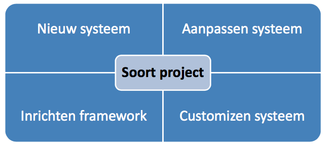
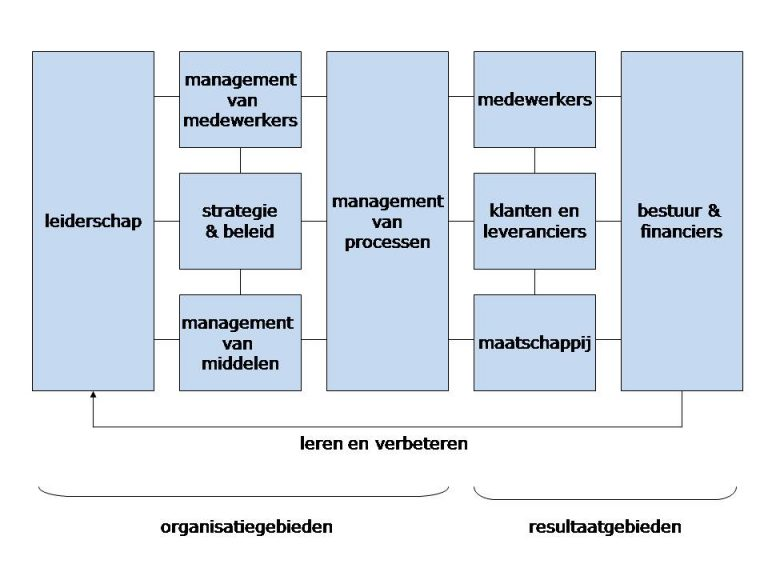
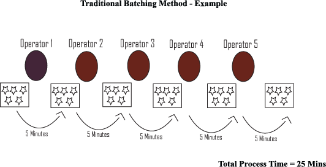
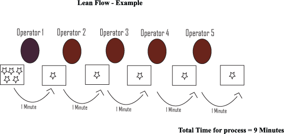
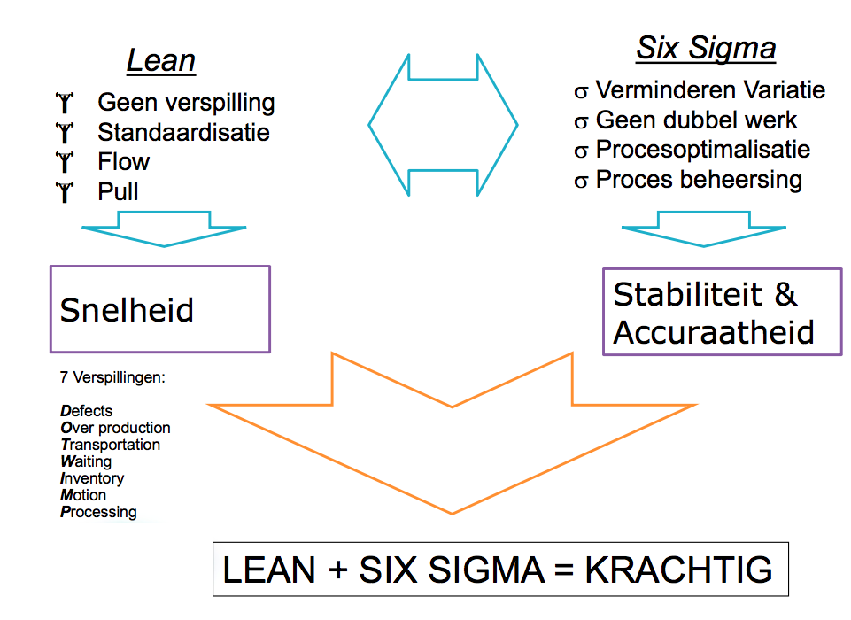

# IQUA

De student heeft kennis van:

- Definitie(s) van kwaliteit, kwaliteit algemeen
- Software Ontwikkelingsmethoden (Waterval, Scrum, Agile, incrementeel/iteratief/IAD)
- Testmethode (TMap)
- Kwaliteitsmodellen (INK, PMBOK, CMMI, Lean, SixSigma)
- Projectmanagement (Prince2, Six Sigma / DMAIC)
- Auditing

# Introductie

**Wat is kwaliteit?**

> De mate waarin een product of dienst beantwoordt aan de behoeftes of verwachtingen die kenbaar gemaakt zijn, vanzelfsprekend zijn of dwingend voorgeschreven zijn (door klante, consument, wet).

## TMap

**T**est **M**anage **Approach** oftewel **TMap** is een testmethode voor software.

### Fasering

TMap kent verschillende fasen waarin de testwerkzaamheden worden uitgevoerd.. et voorbereiden en specificeren van de testcases wordt gelijktijdig met het ontwerp- en ontwikkelwerk gedaan. Tegen de tijd dat een (deel)product dan eenmaal wordt opgeleverd hoeft het testen en goedkeuren niet veel tijd in beslag te nemen. De acceptatiecriteria en testcases zijn immers van tevoren vastgelegd. De gehanteerde fasen zijn;

- Planning en beheer (master testplan word geschreven) - In deze fase word de teststrategie bepaalt en een test plan opgesteld. Er wordt een begin gemaakt met de inrichting voor een test organisatie en infrastructuur. - Om het proces te bewaken worden er voortgang rapportages bijgehouden.
- Voorbereiding - Vaststelling testbasis - Onderverdeling testbare eenheden
- Specificatie - Specificeren testgevallen met uitgangssituati, mutatie, eindresultaat. - Inrichting testinfrastructuur
- Testfasering / Uitvoering - Installatie test omgeving - Controle op werking applicaties - Uitvoeren van pre-tests - Uitvoeren van testscripts - Verklaring foutieve uitkomsten. - Voortdurend: risicorapportage, voortgang etc. Steeds testen uitvoeren

- Evaluatie en afronding - Evaluatie van test proces, lessons-learned - Eindrapportage - 'Opruimen'

### V-model

Het V-Model is een extensie van de waterval methode waarbij iedere testfase gepaard gaat met een development fase. Dit betekent dat er voor iedere fase in de development cyclus, er een test fase aan gekoppeld zit. De volgende fase begint alleen als de vorige fase is afgerond.
Het testen parallel aan ontwikkeling.

#### Verification Phases

##### Business Requirement Analysis

Dit is de eerste fase in de development cyclus waar de product requirements worden vastgelegd samen met de klant. Deze fase staat communicatie centraal. Klanten weten niet wat ze precies willen. De **acceptance test design planning** word gedaan in dit stadium.

##### System design

Daarna komt de volgende fase system design. In deze fase worden de requirements geanalyseerd en worden de mogelijkheden en technieken onderzocht. Als een requirement niet mogelijk is word de klant geinformeerd. In deze fase word ook de algemene en technische documentatie verzorgd. De **system test** plan is ontwikkeld op basis van de system design.

##### Architectural Design

De architectuur word in deze fase ontworpen. Technische keuzes worden gemaakt. Het systeem word opgedeeld in modules met verschillende functionaliteiten. Dit word ook wel **High Level Design (HLD)** genoemd. De communicatie tussen de interne modules en andere externe systemen word gedefineerd in dit stadium. Met deze informatie worden de **integration tests** ontworpen en gedocumenteerd.

##### Module design

In deze fase wordt het gedetaileerde interne ontwerp voor alle modules gespecificeerd. Dit heet **Low Level Design (LLD)**. De testen die hier worden uitvoerd zijn **unit tests**.

##### Coding phase

#### Validation Phases

##### Unit testing

Bij de Unittest worden de individuele componenten getest: voldoen zij aan de voorwaarden beschreven in component design? In theorie zou een onafhankelijke tester dit moeten doen, maar in de praktijk wordt dit meestal gedaan door de ontwikkelaar zelf. Een probleem bij de unittest is dat de component wellicht door de test "individueel" heen komt, maar uiteindelijk zal moeten werken in een volledig systeem. Daarom wordt er vaak software gebruikt die de component wijs maakt dat dit in een compleet systeem functioneert, terwijl dit dus nog helemaal niet zo is.

##### Integration testing

Wanneer componenten afzonderlijk zijn getest begint de integratietest, dit is in feite kijken of de componenten wanneer zij aan elkaar gekoppeld zijn ook nog naar wens functioneren. Deze test kan door de ontwikkelaar of door specialisten worden gedaan.

##### System testing

Wanneer het volledige systeem is gebouwd is het tijd voor de systeemtest. Hierin wordt gekeken of alle vereisten kunnen worden gehaald. Dit is niet het testen van verschillende componenten, maar meer het volledige systeem. Denk hierbij aan het testen van onder andere:

- Performance - Zijn de vooraf opgestelde doelstellingen voor dit punt bereikt?
- Volume - Kan het systeem grote hoeveelheden informatie aan?
- Stress - Kan het systeem grote hoeveelheden informatie op een bepaald tijdstip aan? (piekuren)
- Documentatie - Is de documentatie die er wordt bijgeleverd bruikbaar voor het uiteindelijke systeem?
- Robustness - Blijft het systeem stabiel onder uitzonderlijke omstandigheden?

##### Acceptance testing

De acceptatietest test feitelijk de business case: levert het systeem wat de klant er van verwacht om voor hem een voordeel op te leveren in zijn werkveld? Met andere woorden zijn alle vereisten bereikt. Deze test moet uiteraard worden gedaan door de klant / gebruiker. Men spreekt dan ook wel van de UAT (User Acceptance Test) oftewel in goed Nederlands, de Gebruikersacceptatietest.

# Software ontwikkelmethoden

## Software ontwikkelmethoden

De IT wereld:

- Complexiteit van producten en aanbieders
- Snelle veranderingen
- Kennis is nog steeds schaars
- Eigen terminologie

Een IT project kan op verschillende aspecten betrekking hebben:

Top 5 oorzaken voor problemen bij projecten:

- Eisen - "Interpretatieverschillen = communicatie" - Onduidelijk - Geen overeenstemming - Geen prioriteit - Tegenstrijdig - Onnauwkeurig
- Mensen - "Techniek blijft mensenwerk" - Onvoldoende resources - Conflicten, fouten, bugs
- Deadlines - "Overfixeren van projectonderdelen" - Te strak - Onrealistisch
- Planning - "Projectplanning is een levend iets" - Slecht geschat - Te weinig informatie
- Risico's - "Bad risk management" - Niet geïdentificeerd

> Wat is een softwareontwikkelmethodiek? Een softwareontwikkelmethodiek is een gestructureerde manier van werken. Gedocumenteerde manier van werken. Keuze sluit aan bij project.

Typen Software ontwikkelmethode:

- Linear - Afgebakende fases die na elkaar opvolgen - Geen 'loop' naar eerder fases - Meestal big bang invoeren.
- Incrementeel - Werkende eenheden (incrementen, pilots) - Functionaliteit groeit geleidelijk
- Iteratief - Feedbackloops op tussenversies (prototypes)

### History

## IAD

Bij Iterative application development, oftwewel IAD, zijn er 3 fasen. Definitiestudie, pilotontwikkeling en invoering. Deze 3 fasen worden iteratief uitgevoerd.

### Definitiestudie

In de eerste fase worden de doelen van het te ontwerpen systeem onderzocht en beschreven. Beperking en randvoorwaarden worden genoteerd. Als er al een pilot is afgerond (als er al een vorige iteratie is geweest) dan word de pilot geëvalueerd. Bij elke cycli van ontwikkeling wordt het uiteindelijke plan steeds verder uitgewerkt en uitgedetailleerd. De wens van het systeem word steeds duidelijker.

### Pilotontwikkeling

In de tweede fase word er begonnen met de ontwikkeling van de pilot. Er kan 1 pilot of meerdere pilots kunnen tegelijkertijd worden uitgevoerd. Er worden workshops gehouden voor het pilotontwerp en pilotontwikkeling. Tijdens de pilotontwerp workshops wordt er gekeken hoe de globale functionele specificaties van de in aanbouw zijnde pilot eruitzien. Er wordt een **prototype** gemaakt van het uiteindelijke systeem. Delen van de pilot of pilots worden hierna door één of meerdere ontwikkelteams gebouwd, zogenaamde **A-teams**. A-teams zijn kleine groepen goed samenwerkende professionals, die elk hun eigen specialisatie hebben en allemaal in fasen van de ontwikkelingcycli kunnen werken. Tegengesteld zullen gebruikers die betrokken zijn bij de ontwikkeling opereren in **U-teams**.

### Invoering

In de derde fase worden de, in voorgaande fase ontwikkelde, pilot operationeel gemaakt en ingevoerd in de organisatie. Ervaringen die zijn opgedaan worden verzameld en opgeslagen voor de volgende pilot.

### Iteraties strategieën

- Evolutionair ontwikkelen - Alle fases worden uitgevoer en in z'n geheel in de iteratie meegenomen (Pijl van invoering -> defenitiestudie). Niet alle systeemeisen worden in 1 keer opgesteld. Niet geschikt voor fixed price projecten (Een Fixed Price contract is een soort contract , waar het te betalen bedrag is niet afhankelijk van de gebruikte middelen of tijd besteed) .
- Incrementeel opleveren - De eerste fase definitiestudie wordt dus eenmalig uitgevoerd. Dit in tegenstelling tot evolutionair ontwikkelen, alwaar die fase net zo vaak wordt uitgevoerd als de fasen pilot ontwikkeling en de invoering. (Pijl van inovering -> pilotontwikkeling). Handig bij duidelijke systeemeisen, weinig beschikbaarheid key users.
- Incrementeel ontwikkelen (RAD) - Hetzelfde als incrementeel opleveren maar er wordt in één keer ingevoerd (pijl van pilotontwikkeling -> zichzelf). Heeft veel weg van Rapid Application Development. Snel ontwikkelen met minimum aan documentatie, veel workshops.
- Big-bang-invoeren - Hetzelfde als incrementeel opleveren maar er wordt in één keer ingevoerd (pijl van pilotontwikkeling -> zichzelf). Heeft veel weg van Rapid Application Development. Snel ontwikkelen met minimum aan documentatie, veel workshops.

### Requirements

- Workshops met gebruikers - Multidisciplinair - Mensen met verschillende functies en rollen - Cross-functional - Mensen van verschillend afdelingen - Brainstorming - Echt brainstormen, probleemoplossend denken - Beeldvormen en documenteren - Systeemeisen worden geinventariseerd, gecategoriseerd en geprioriteerd.

## Scope creep

Tijdens het ontwikkelen kan het gebeuren dat de systeemeisen vervagen en dat de scope van het project groter word dat vooraf is vastgesteld. Hierdoor lopen projecten uit.

### Timeboxing

Timeboxing is het vooraf beperken van de hoeveelheid tijd die men aan een bepaalde activiteit wil en mag besteden. Dit om te voorkomen dat iets uitloopt. Timeboxing wordt gebruikt als een methode om projecten te plannen. De planning bestaat uit een aantal verschillende perioden (timeboxes), met elk hun eigen producten, budget en deadline.

## Agile

Risico's verminderen door:

- Adaptability: omgaan met veranderende omgeving van het project en dus de wensen en eisen van gebruikers.
- Flexibility: de snelheid van uitvoeren en het verbeteren van communicatie met als doel om de juiste balans te vinden tussen wat de klant en wat de business verwacht.

### Scrum

> Definition of Done: alleen dingen op de checklist die echt klaar zijn worden opgeleverd. (functionaliteit en kwaliteit)

Aantal puntjes van SCRUM:

- Heeft geen stuurgroep
- Werkt met sprints (agile)
- Daily scrum meetings
- Scrum master heeft de leiding
- Op het einde sprint review
- Als het nog niet af is, nieuwe sprint met het werk wat niet af is.
- Burndown/up charts
- Product owner is verantwoordelijk voor het product backlog
- Spring backlog is alles wat je gaat maken in een sprint
- Definition of Done (wanneer is iets echt klaar)

> Definition of Done: Alleen dinge op de checklist die echt klaar zijn worden opgeleverd.

### Extreme programming

> Een humanistische discipline van software-ontwikkeling, gebaseerd op de beginselen van eenvoud, communicatie, feedback, en moed.

De optimale kracht van XP komt voort uit het in samenhang toepassen van twaalf best practices van software ontwikkeling:

- Feedback - Pair programming - Planning - Test Driven Development - EEN team
- Continu proces - Continue integratie - Refactoring - Korte iteraties
- Gedeelde kennis - Metafoor - Standaarden - De code is van iedereen - Eenvoud van ontwerp
- Welzijn van ontwikkelaars

## Wat ze uiteindelijk allemaal doen

- Requirements opstellen - Met en door wie?
- Requirements prioriteren - **M**o**SC**o**W** - Cijfers - Basis, Comfort, Luxe (IAD)
- Requirements toetsen en vastleggen

## Tips om methodisch te werk te gaan

- Vind de ‘juiste’ mensen - Wie zijn de key users/champions? - Wie zijn de Subject Matter Experts (SME’s) (
- Houdt rekening met diverse ‘Gebeurtenissen’
- Bekijk bestaande documentatie
- Stel veel vragen
- Krachtig en helder documenteren

# Proces

- Standaard aanpak om iets te doen/maken, gedocumenteerd of herhaalbaar gedrag/aanpak.
- Combinatie van mensen, middelen, materialen, methoden en omgeving die voor bepaalde output zorgt (product, dienst).
- Kwaliteit van product komt voort uit kwaliteit van proces
- Een ‘proces’ wordt nog te weinig gezien als een aanwinst (zoals producten of mensen/resources of eigendom van bedrijf)

## Soorten processen

### Besturende processen

Besturende- of managementprocessen omvatten alle acitviteiten betreffende het plannen, controleren, evalueren en bijsturen. In een procesgerichte organisatie vindt besturen op strategisch, tactisch en operationeel niveau plaats. Daarnaast onderscheiden we nog de besturen van de procesontwikkeling zelf. Dit soort besturende processen worden verbeterprocessen genoemd.

### Primaire processen

Primaraire processe (ook kern- of operationele processen genoemd) beschrijven de dienstverlening of het productieproces. Primaire processen lopen van klant tot klant. Voor een productiebedrijf zijn dat: productontwerp, productontwikkeling, de productie zelf en de logistieke distributiefunctie. Voor dienstverlenend bedrijf: intake, behandeling en nazorg.

### Onderstudende processen

Ondersteunende processen zijn ondersteunend aan de primaire processen (uiteraard ook aan de besturingsprocessen zelf). Resultaat zijn mensen en middelen zoals informatie, faciliteiten en financien.

# Continious Proces Improvement

- Waarom een kwaliteits model? - Standaard manier voor bepalen en meten kwaliteit.
- Wat heb je nodig als je wilt weten wat de kwaliteit van een proces ?
  -Informatie over het proces - Van welke kwaliteit zijn de resultaten van het proces? - Welke kwaliteit zouden de resultaten **moeten hebben**?
- Wat is de kwaliteit van veranderingen en verbeteringen?
- Hoe zorgen we voor **Continuous Improvement**?

# Plan, Do, Check, Act

De **kwaliteitscirkel van Deming** is een hulpmiddel voor kwaliteitsmanagement en probleemoplossing. De cirkel beschrijft 4 activiteiten die op alle verbeteringen van toepassing zijn. De vier activiteiten worden iteratief doorlopen en zorgen voor een betere kwaliteit. PDCA dient als basis voor [INK](#ink) en [PMBOK](#pmbok)

## Plan

Kijk naar de huidige werkzaamheden en ontwerp een plan voor de verbetering ervan. Stel doelstellingen vast.

## Do

Voer de geplande verbetering uit in een gecontroleerde proefopstelling

## Check

Meet het resultaat van de verbetering en vergelijk deze met de oorspronkelijke situatie en toets deze aan de vastgestelde doelstellingen.

## Act

Bijstellen aan de hand van de resultaten uit voorgaande activiteit.

# INK

Het INK model is een evaluatie tool dat schematisch weergeeft de tien belangrijkste aspecten van een organisatie in hun onderlinge verband weer. Om goed sturing te kunnen geven aan de organisatie dient het management aandacht te besteden aan elk van de 10 aandachtsgebieden.

**Kenmerken**

- Leiderschap met lef
- Resultaatgerichtheid
- Continue verbeteren
- Transparantie
- Samenwerking

## Aandachtsgebieden

1. Leiderschap
2. Beleid en strategie
3. HRM
4. Middelenmanagement
5. Management van processen

Resultaatgebieden waarbij het gaat om:

6. Waardering door klanten
7. Waardering door medewerkers
8. Waardering door de maatschappij
9. Behaalde ondernemingsresultaten

In de vijf organisatiegebieden, de linker helft van het model, wordt weergeven hoe de organisatie is ingericht, gelet op de visie en de doelen van de organisatie. Ook wordt hier informatie aangereikt in welke richting de organisatie zich zou kunnen verbeteren.

De vier resultaatsgebieden (de rechter helft van het model) geven weer wat de beoogde of bereikte resultaten zijn van de organisatie. De gedachte hierbij is dat een organisatie altijd resultaten bereikt voor een bepaalde doelgroep. Dat kunnen zijn: klanten, leveranciers en samenwerkingspartners, de eigen medewerkers, de maatschappij, het bestuur en de financiers (bijv. de overheid) van de organisatie.

Het INK stelt in welk mate wil de organisatie tegemoet komen aan de wensen/verwachtingen/behoefte van de verschillende doelgroepen.

## Fasen

Het INK model word in 5 fasen onderscheiden

1. Activiteit georiënteerd
   - Kwaliteit centraal
2. Proces georiënteerd
3. Systeem georiënteerd
4. Keten georiënteerd
5. Transformatie georiënteerd

# IMWR en PCDA

De IMWR cyclus is nodig om de PDCA cyclus draaiend te krijgen. Elke stap uit de PDCA cyclus wordt verbonden met een werkwoord. Die weerspiegelen de aandacht die met name het management moet geven aan elke stap in de PDCA cyclus.

- Inspireren en plan - Om de plannen te laten lukken moet management de medewerkers inspireren
- Mobiliseren en do - Zonder mensen te mobiliseren en te motiveren komt de uitvoering niet van de grond
- Waarderen en check - Een sfeer van vertrouwen en veiligheid is nodig om elkaar aan te kunnen spreken op negatieve en positieve prestaties.
- Reflecteren en act - Het actualiseren en bijstellen van de plannen zal veel beter verlopen wanneer management en medewerkers vrijuit kunnen reflecteren

# PMBOK

**Project Management Body of Knowledge** is een poging om algemeen erkende projectmangement informatie en gebruiken te beschrijven en standaardiseren. Tijdens een project doorloopt het projectbeheer een periodieke cyclus van projectinitiatie, planning, uitvoering, controle & bijsturing en projectafsluiting. Een project dient volgens PMBOK te worden benaderd vanuit 10 verschillende aandachtsgebieden:

| Elements of managing projects  | Kennisgebieden                                                                                                                                                                   |
| ------------------------------ | -------------------------------------------------------------------------------------------------------------------------------------------------------------------------------- |
| Project Integration Management | Integratie. Ontwikkel het Project Contract, Scope Statement en Plan. Leid, manage, controller en beheers veranderingen in het project                                            |
| Scope management               | Werkingsgebied. Planning, Definitie, Work Break-down Structure (WBS) Creatie, Verificatie en Controle                                                                            |
| Time management                | Tijd. Definitie, volgordebepaling, Middelen en Duur prognose, Planningsontwikkeling en Planningscontrole                                                                         |
| Cost management                | Kosten. Middelen planning, Kosteninschatting, Budgettering, Controle                                                                                                             |
| Quality management             | Kwaliteit, Kwaliteitsplanning, Kwaliteitsbewaking en Kwaliteitsbeheersing (Controleren of het project tegemoet komt aan alle contractueel vastgelegde eisen van de opdrachtgever |
| Human Resources management     | Human Resources. HRM Planning, Aannemen, Ontwikkelen, en Managen van Projectteam                                                                                                 |
| Communications Management      | Communicaties. Communicatieplanning, Informatiedistributie, Prestatierapportage, Stakeholdermanagement                                                                           |
| Risk management                | Risico's. Risicoplanning en Identificatie, Risicoanalyse zowel kwalitatief als kwantitatief. Reactie's op risico's (acties)                                                      |
| Procuremanagement              | Inkoop. Aankoop en Inhuurplan, Reacties van verkopers en selectie. Contract administratie en contractafsluiting                                                                  |

# CMMI

> CMMI is een framework voor procesbeheersing (dus geen standaard of norm zoals PMBOK en ISO)

De kwaliteit van het (te ontwikkelen) software systeem wordt sterk beïnvloed door de kwaliteit van het proces om dit systeem aan te schaffen, te ontwikkelen/inrichten en onderhouden. Je komt een heel eind met goede mensen, goede methoden en technieken en tools en materiaal (apparaten, hardware etc), maar zonder een goed proces komt de haalbaarheid en de mate van succes onder druk te staan.

Capability Maturity Model Integration (CMMI) geeft aan op welk niveau softwareontwikkeling van een organisatie zit. Je kun het ook de volwassenheid van de organisatie noemen. Ontwikkeld voor 3 branches. Development, Acquisition, Service

## Maturity levels

CMMI heeft verschillende niveau's van maturity:

1. Initial (Initieel)
   - Ad hoc probleemoplossen
   - Onbekend welke hulpmiddelen voor resultaat
   - Geen structuur voor verbetering
2. Repeatable (Herhalend)
   - Sprake van ontwikkeling
   - Informatie word gebruikt die eerder is opgedaan.
   - Er is sprake van kennis
3. Defined (Gedefineerd)
   - Processen zijn beschreven en onder controle
   - Processen kunnen verbeterd worden door kennis
4. Managed
   - Procesbeheersing
   - Kwaliteit van proces kan worden gemeten
   - Proces kan worden bijgestuurd
5. Optimized (Geoptimaliseerd)
   - Verbeterpunten en actieplannen worden uitgewerkt en uitgevoerd

## Aandachtspunten

Aandachtspunten van CMMI zijn:

- Vaststellen op welk niveau een organisatie zich bevind. Met goede leiding kan de organisatie naar een hoger niveau.
- Er kan geen niveau worden overgeslagen
- Meeste ondernemingen op niveau 3

## CCMI wel of niet?

- Kan samengaan met software ontwikkelmethodieken.
- Draagt bij aan de voorspelbaarheid, consistentie en herhaalbaarheid van processen.
- Niet het wiel opnieuw hoeven uitvinden
- Lerende organisaties
- Veel voorwaarden aan documentatie
- Geschikt voor grote organisaties

# SCAMPI

Standaardmethodeomhetniveauvan procesverbetering te evalueren en vaststellen:

> Hoe goed is deze organisatie in het verbeteren
> van hun processen?

Er zijn 3 klassen voor de striktheid waarop het niveau van procesverbetering wordt beoordeeld A, B en C. Daaruit volgt een lijst met conclusies, aanbevelingen en een rating over de volwassenheid van de organisatie.

# LEAN

LEAN is een business strategie en een manier van werken waarbij alles en iedereen in de onderneming zich richt op het creeren van waarde voor de klant in alle processen. Verspillingen worden geelimineerd. Doordat de klant centraal staat creeer je maximale toegevoegde waarden voor de klant tegen minimale inspanning.

> Een Lean bedrijf is zich bewust van haar omgeving en wil niet alleen voor de klanten, maar ook voor de maatschappij waarde toevoegen.

> Lean richt op het verlagen van de kosten

Iedere activiteit die de vorm of functie van een product of dienst aanpast, creëert de waarde. Lean richt zich op het verwijderen van verspilling zoals afval, overschotten, restanten om kosten te besparen: "remove non-value adding activities"

## Muri

Er is sprake van **muri** wanneer er boven de capiciteit van een persoon of machine geproduceerd moet worden, oftewel **overbelasting**.

## Muda

Met **muda** wordt elke activiteit bedoeld die beslag legt op resources maar geen waarde toevoegt voor de klant, oftewel **verspilling**. Er zijn 3 soorten groepen activiteiten;

- waardetoevoegende activiteiten. Die moeten behouden worden.
- niet-waardetoevoegende activiteiten. Die echter wel nodig zijn om aan externe en interne eisen te voldoen. Denk hierbij aan wet- en regelgeving en intern beleid. Die moeten verminderd worden.
- verspillingen. Die moeten geëlimineerd worden.

Standaardvormen van verspilling zijn:

| Verspilling   | Beschrijving                                                                                                                  |
| ------------- | ----------------------------------------------------------------------------------------------------------------------------- |
| Overproductie | meer of sneller produceren dan de klant vraagt                                                                                |
| Overbewerking | Meer toevoegen aan het product of dienst dan de klant nodig heeft                                                             |
| Transport     | Tussen-, eindproducten, medewerkers en soms klanten worden verplaatst                                                         |
| Beweging      | De medewerker of de klant moet niet-waardetoevoegende handelingen uitvoeren om het product of de dienst op te kunnen leveren  |
| Wachten       | De medewerker of klant moet het product of de dienst stillegegn totdat een batchrun, collega of leverancier iets heeft gedaan |
| Correctie     | Aan product of dienst moet voor de tweede keer gewerkt worden omdat er de eerste keer iets fout is gegaan                     |
| Voorraad      | Buffers van hulpmiddelen, materialen en capaciteit die op dit moment niet gebruikt worden.                                    |
| Talen         | Inzetten van mensen op werk dat ze niet leuk vinden, hen niet uitdaagt of waarvoor ze de kennis en vaardigheden missen.       |

## Mura

De aanwezigheid van ongelijkheden binnen een proces heet mura. Een voorbeeld is grote tempowisselingen. Mura is te vergelijken met de uitspraak "hollen of stilstaan". Mura kan voorkomen worden door in te springen op productietijden en daar de capaciteiten op af te stemmen.

# Six Sigma

> Processen kun je pas goed beheersen als je weet hoe elk proces verloopt en om dat te weten moet er gemeten worden: “meten is weten”. Dit is de basis van Six Sigma.

<!-- TODO verbeteren en aanvullen -->

Op data gebaseerde kwaliteit- en procesverbeteringsmethode middels:

– Vermindering van variaties
– Verwijdering van restanten en ‘dingen overdoen’
– Optimalisatie van proces
– Procesbeheersing

Een beheersbaar proces is:  
– Stabiel
– Accuraat
– Voorspelbaar

<!-- TODO chaotisch, doorlezen en refactoren en verder afmaken. Gestopt bij sheet 19-->

# Waarom dan toepassen in IT?

- Op proces niveau toch ‘winst’ te behalen met bepaalde tools uit LEAN Six Sigma
- Verbeterprojecten veelal een IT component
- IT productie: chips, laptops
- In combinatie met changemanagement meer succesvol

# Lean

## Tools van Lean

### House of Lean

"House of Lean" is een tool dat kan je helpen begrijpen in welke volgorde lean geimplementeerd moet worden. Een huis word gebruikt omdat het illustreert hoe de structuur gebouwd moet worden.

> The foundation comes first, and the walls must be built before the roof can be put on.

### Lean flow

> Flow is about increasing the throughput of work undertaken in the process, whilst improving quality and customer satisfaction.

De uitgangspunten van Lean Flow zijn de doorlooptijd te verkorten en met zo min mogelijk middelen.

> Om een voorbeeld te geven. Stel je voor dat iedere van handeling 1 minuut duurt en dat iedere partij van 5 items niet bewegen tot dat alle handelingen voor die ene proces stap zijn voltooid. Persoon 1 verwerkt 5 items in 5 minuten. Daarna gaat het naar de volgende persoon en dit doet er ook 5 minuten over. In totaal zijn er 5 personen voor het gehele proces en waardoor het proces 25 minuten duurt.

### Takt Time

> Takt time is the average time between the start of production of one unit and the start of production of the next unit, when these production starts are set to match the rate of customer demand.

### Lean roadmap

De 5 fasen om tot een lean-organisatie te komen zijn:

|     Fase     | Beschrijving                                                                            |
| :----------: | --------------------------------------------------------------------------------------- |
|    Value     | Datgene waarvoor de klant bereid is te betalen                                          |
| Value stream | De acties die uitgevoerd worden om een product of dienst aan de klant te kunnen leveren |
|     Flow     | De flow van het proces                                                                  |
|     Pull     | Signalen vanuit de hoek van de klant.                                                   |
|  Perfection  | Proces perfectioneren. Streef naar perfectie                                            |

### Value stream map

> Een **"Value Stream Map"** wordt gebruikt om bedrijfsprocessen vast te leggen, te analyseren en te verbeteren.

Een value stream map brengt alle stappen wat een bedrijf doet om een product af te leveren bij de klant. Van elke stap word opgeschreven welk materiaal en welke informatie daarvoor nodig zijn.

Een voorbeeld van een map is:

### Samengevat

Lean betekent producteren en inkopen:

- Wat exact nodig is
- Wanneer het nodig is
- Geleverd waar nodig is

Bereikt door focus te houden op:

- 7 muda's
- Takt
- Flow
- Pull/kanban
- Perfectie

# LEAN en Six Sigma

LEAN en Six Sigma samen leidt tot een wereldwijd bewezen en toegepaste methodiek verbetering van het bedrijfsresultaat aantoonbaar en duurzaam is. LEAN en SIX Sigma is een verzameling tools die de kwaliteiten van processen verbeteren door op zoek te gaan naar de oorzaak van fouten. LeanSixSigmareduceertdevariatiein productie en bedrijfsprocessen met als doel om producten en/of diensten in overeenstemming te laten komen met de verwachting die de klant heeft. Het is een management methode voor procesoptimalisatie. Lean Six Sigma is een combinatie van twee verbeter- methoden. Theoretisch levert dat processen op die niet alleen logistiek efficiënt (Lean) zijn, maar ook kwalitatief goed (Six Sigma)

- Operationele kosten terug brengen
- Klanttevredenheid vergroten
- Doorlooptijden verkleinen

## DMAIC fasering bij LEAN Six Sigma

| DMAIC stage | Lean Six Sigma                                                                                                      |
| :---------: | ------------------------------------------------------------------------------------------------------------------- |
|   Define    | - Initiate the project - Define the process - Determine customer requirements - Define key process output variables |
|   Measure   | - Understand the process - Evaluate risks on process inputs - Evaluate measurement systems                          |
|   Analyze   | - Analyze data to prioritize key input variables - Identify waste                                                   |
|   Improve   | - Verify critical inputs using planned experiments - Design improvements - Pilot new process                        |
|   Control   | - Finalize the control system - Verify the long term capability - Close project                                     |

## Lean Six Sigma Belt structuur

Lean Six Sigma introduceren en implementeren vraagt om een complete en goed gestructureerde infrastructuur. Lean Six Sigma-projecten worden namelijk uitgevoerd door de mensen die er het meeste van weten: de eigen medewerkers. De benodigde infrastructuur voor een succesvolle Lean Six Sigma implementatie omvat een Championteam, een Master Black Belt, Black Belts, Green Belts en Orange Belts.

|       Teams       | Beschrijving                                                                                                                                                                                  |
| :---------------: | --------------------------------------------------------------------------------------------------------------------------------------------------------------------------------------------- |
|   Championteam    | Het championteam definieert en beoordeelt de Lean Six Sigmaverbeterprojecten, fungeert als strategisch leider en is verantwoordelijk voor het wegnemen van belemmeringen van de projectteams. |
| Master Black Belt | Verandermanager en inhoudelijk coach. Bied hoogwaardige kennis en kwaliteit als gereedschap voor projectteams. 1 voor 1000 medewerkers.                                                       |
|    Black Belts    | Managen en controleren de projecten.                                                                                                                                                          |
|    Green Belts    | Ondersteunen de Black Belts. 100 voor 1000 medewerkers                                                                                                                                        |
|    Orang belts    | Basis van Lean Six Sigmaprogramma. Kennen en begrijpen verbeteren processe. Bron voor toekomstige Green Belts.                                                                                |

# Proces capability

> Het maakt niet uit hoe goed controle en test processen zijn, hoe meer fouten er ontstaan, hoe meer fouten er ontsnappen aan het proces naar de klant toe. In hoeverre kan het proces consistent de producten en services leveren, die aan de specificaties voldoen zoals vooraf gedefinieerd op basis van klantbehoefte?

# Six Sigma

# GOTIK

GOTIK is een methode voor het beheersen van verschillende aspecten van projectmanagement. De aspecten zijn geld, organisatie, tijd, informatie en kwaliteit. GOTIK word het meest gebruikt bij bouw projecten.

| Aandachtsgebieden | Toelichting                                                                                                                                                        |
| :---------------: | ------------------------------------------------------------------------------------------------------------------------------------------------------------------ |
|       Geld        | Totaal aan financiële middelen voor realisatie project (projectdoelstellingen maar ook project kosten)                                                             |
|    Organisatie    | Projectorganisatie in een schema ter verduidelijking van taken, verantwoordelijkheden en bevoegdheden van projectleden, bedrijven enzo.                            |
|       Tijd        | Het tijdsaspect van het project op zich en alle aspecten van tijd rond het project                                                                                 |
|    Informatie     | Alle beschikbare informatie die voorafgaand aan het project, tijdens en achteraf aanwezig was, er van buiten af bij komt en binnen het project wordt geproduceerd. |
|     Kwaliteit     | Het totaal aan kwaliteitskenmerken en kwaliteitswaarborgen (resultaten en project zelf)                                                                            |

## GOTIK project fasering

Een GOTIK project kent net als andere projecten een aantal specifieke stappen of fases. De meeste GOTIK projecten betreffen een bouwproject. De fases binnen zo een bouwproject zijn:

| Fase          | Bedoeling                                                                                                    |
| ------------- | ------------------------------------------------------------------------------------------------------------ |
| Initiatief    | Bedenken wat het project wel en wat het niet moet zijn; alle betrokkenen hebben een gelijk beeld             |
| Definitie     | Bedenken hoe het resultaat moet voldoen (eisen, wensen etc.)                                                 |
| Ontwerp       | Bedenken hoe het project er uit moet zien; een gedetailleerd uitgewerkte oplossing                           |
| Voorbereiding | Bedenken hoe het project er uit zal gaan zien; met een druk op de knop het het resultaat er vlekkeloos komen |
| Realisatie    | Uitvoeren, invoeren of maken van het project zodat het projectresultaat er ook helemaal is                   |
| Nazorg        | Gebruiken, beheren, onderhouden en vernietigen van het project                                               |

## GOTIK fasering en aandachtsgebieden

Binnen iedere fase worden de aandachtsvelden uit het GOTIK-Model meegenomen. Daardoor ontstaat een eenvoudig te hanteren kruistabel:

| GOTIK-methode | Geld | Organisatie | Tijd | Informatie | Kwaliteit |
| ------------- | ---- | ----------- | ---- | ---------- | --------- |
| Initiatief    |      |             |      |            |           |
| Definitie     |      |             |      |            |           |
| Ontwerp       |      |             |      |            |           |
| Voorbereiding |      |             |      |            |           |
| Realisatie    |      |             |      |            |           |
| Nazorg        |      |             |      |            |           |  |

# Communicatie

> ‘Effective communication means that the information is provided in the right format, at the right time, to the right audience, and with the right impact. Efficient communication means providing only the information that is needed’

GOTICK = GOTIK + Communicatie

Hoe kun je communicatie in een project manage?

- Afspraken communicatie: Communicatie plan, meestal een plan gericht op communicatie bij invoering/uitrollen project - Doelgroep - SMART doelstellingen - Boodschap
- Wat voor vergaderingen, rapportage, rollen?
- Tussentijds evalueren
- Communicatie training / teambuilding

# RACI

Het RACI-model is een matrix die gehanteerd wordt om de rollen en verantwoordelijkheden van de personen die bij een project of lijnwerkzaamheden betrokken zijn weer te geven.

| RACI        | Beschrijving                                                                                                                                                                                                 |
| ----------- | ------------------------------------------------------------------------------------------------------------------------------------------------------------------------------------------------------------ |
| Responsible | Degene die verantwoordelijk is voor de uitvoering. Verantwoording wordt afgelegd aan de persoon die accountable is.                                                                                          |
| Accountable | Degene die eindverantwoordelijk, bevoegd is en goedkeuring geeft aan het resultaat. als het erom gaat moet die persoon het eindoordeel kunnen vellen, vetorecht hebben. Er is slechts 1 persoon accountable. |
| Consulted   | Deze persoon geeft richting aan het resultaat, die persoon wordt voorafgaand aan beslissingen of acties geraadpleegd. Dit is tweerichtingscommunicatie.                                                      |
| Informed    | Iemand die geïnformeerd wordt over beslissingen, over de voortgang, bereikte resultaten enz. Dit is eenrichtingscommunicatie.                                                                                |

# DMAIC

DMAIC staat voor Define, Measure, Analyze, Improve and Control en is een methode die in de bedrijfswereld wordt gebruikt om Six Sigma-processen inhoudelijk te verbeteren. Het kan mogelijk iteratief gebruikt worden en richt zich op 1 probleem.

| DMAIC   | Beschrijving                                                                                                            |
| ------- | ----------------------------------------------------------------------------------------------------------------------- |
| Define  | Stappen om project en proces te definiëren: Project Charter, Probleemdefinitie, Projectteam, SIPOC                      |
| Measure | Proces begrijpen middels data en performance metingen: Meetplan, Meetsysteem tests, data verzamelen, Process Capability |
| Analyse | Input- en output variabelen analyseren en verspilling en kansen identificeren                                           |
| Improve | Ideevorming, verbeteren, pilots draaien: Brainstorms, Uitvoeringsplan                                                   |
| Control | Borgen in organisatie: controle zodat toekomstige afwijkingen niet plaats vinden en toezicht op blijvende verbetering   |

## Define

- Is dit het goede project?
- Identificeer het probleem
- Project charter opstellen
- Identificeer het proces waar het probleem zit
- Maak globaal overzicht van het proces - SIPOC
- Project charter herzien

### Probleemdefinitie

- Belangrijkste onderdeel van Project Charter; **Wat is het probleem?**
- Juist omschrijven om project succesvol te laten zijn
- Makkelijk te begrijpen
- Beschrijft de werkelijkheid
- Met doelstelling in meetbare termen
- **Probleemdefinitie bevat geen oplossing voor het probleem en ook geen oorzaken**

Een probleem definitie zou antwoord moeten geven op de volgende vragen:

- Welk soort problemen hebben we mee te maken? Welke problemen moeten we aanpakken: fouten, vertraging, dubbel werk, etc?
- Wanneer en / of waar doet het probleem zich voor?
- Is het probleem te groot gedefineerd?
- Bevat de eerste probleemdefinitie aannames en haastige conclusies?

Een project charter is de eerste stap bij alle kwaliteit methodieken, bij Lean en vooral bij Six Sigma. Het project charter definieert alle interacties van het project en de stappen voor een succesvolle afronding van het project. Het vindt plaats in de Define stap van de DMAIC, en het charter is essentieel voor een succesvol project. Een goed project charter zorgt voor succes door het definiëren van de nodige middelen, mensen en scope van het project, en een slecht projectcharter kan teamfocus, effectiviteit en motivatie verminderen.

- Project heeft een goed gedefinieerde: - Baseline = minimum - Goal = doelstelling - Entitlement = beste ooit behaald
- Voeg meetwaarden toe
- Bestaande KPI's gebruiken indien aanwezig
- Herzien wanneer dat nodig is

---

- Wat is het probleem? Wie zijn de klanten die door dit probleem benadeeld worden?
- Waar en wanneer doet het zich voor?
- Wat is de scope?
- Wat is de planning en wat zijn de kritieke fasen in het proces?
- Wie is mijn klant?
- Wat ga ik opleveren?
- Wat is belangrijk? Wensen en eisen.
- Wat valt binnen en buiten het project?
- Wie neemt deel aan het project?
- Wat levert het op?
- Hoe vatten we het samen?

## Measure

Als het probleem gedefineerd is, worden in de Measure-fase de relevante gegevens gemeten en verzameld. Hierbij zijn de volgende vragen van belang:

- Hoe groot is het probleem?
- Hoe zorg ik ervoor dat de informatie valide is?
- Welke informatie heb ik nodig en wat kan ik categoriseren?
- Hoe specifiek moet het zijn en hoe ga ik de informatie verzamelen?
- Wat heeft voorrang?
- Welke gevolgen zijn er door het probleem?
- Welke data hebben we nodig?
- Is de data betrouwbaar?
- Hebben we detailkennis over het proces?

## Analyse

Nadat de gegevens gemeten en verzameld zijn, worden ze in deze fase geanalyseerd. Hierbij wordt onder andere geprobeerd om oorzaak-gevolgd relaties te herkennen. Verder wordt er in deze fase gezocht naar de volgende antwoorden:

- Wat lijkt het probleem te veroorzaken?
- Welke oorzaken kan ik bedenken?
- Welke prioriteiten stel ik voor nader onderzoek?
- Wat is de grondoorzaak van het probleem?
- Wat zegt de data?
- Zijn er bottlenecks of verspilling?
- Hoe kunnen we op basis van statistische gegevens weten hoe factoren zich van elkaar verschillen?
- Hoe kunnen we op basis van statistische gegevens weten of een factor significant is?
- Wat is het hoofdprobleem wat geadresseerd moet worden? Welke hoofdfactor moet worden aangepast?

## Improve

Als de grondoorzaken bekend zijn is het tijd om verbeteringen te bedenken, te testen en te implementeren. Veelal wordt in deze fase gebruik gemaakt van brainstormsessies. In deze fase is het van belang dat:

- De focus blijft liggen op de beste oplossingen
- De oplossingen worden getest in een pilot
- Indien de pilot succesvol is, de worden de oplossingen daadwerkelijk geïmplementeerd
- Wat adviseer je te doen?
- Welke acties hebben prioriteit?
- Hoe kunnen we de nieuwe oplossing testen?
- Wat zijn de baten en wat levert het financieel op?

## Controle

Deze fase staat in het teken van borging, om terugval te voorkomen. Typische vragen in deze fase zijn:

- Hoe kan ik de resultaten borgen en daarmee terugval voorkomen?
- Hoe kan ik de ontwikkelingen visueel maken en vroegtijdig trends signaleren?
- Hoe moet ik reageren als het signaal er is?
- Wie worden beïnvloed door de verandering en hoe kunnen we zorgen voor verandering in gedrag?
- Zijn wijzigingen zo gedocumenteerd dat veranderingen in de organisatie geen impact hebben om verbeteringen?

# Wat is jouw methode?

- Gebruik je 'common sense'.
- Communiceer zelf helder en to the point
- Bondige gespreks- meeting verslagen
- Follow up als onderdeel van je eigen werkwijze
- Kom terug op je verzonden emails
- Kom terug op inhoud eerdere meetings
- In het land der blinden is eenoog koning
- Vertrouw op je eigen specialisme / kennis / kunde

# Prince 2

> **Pr**ojects **IN** **C**ontrolled **E**nvironments

PRINCE2 is een methode voor projectmanagement. Deze methode is gericht op het management en de besturing en organisatie van een project. PRINCE2 is toepasbaar op alle projecten. Aspecten van de methode die niet van toepassingen zijn kunnen weggelaten worden. De methode bestaat uit 7 principes, 7 thema's en 7 processen. De toepassing van de principes bepaald of iets een PRINCE2-project is, niet de strikte toepassing van de thema's of processen.

Een aantal kenmerken van Prince2 zijn:

- Business Case
- Client / Supplier
- Non IT
- Public domain
- Best practice
- Management by exception
- Proces gericht
- Product based planning
- Geen ontwikkelingsfasering
- Geen /weinig technieken

# Voordelen

## Algemeen

- Herhaalbare methode
- Methode die is te leren / over te brengen
- Gebaseerd op ervaring
- Zorgt er voor dat iedereen weet wat te verwachten, waar, hoe en wanneer
- Vroegtijdig signalering van problemen
- Is pro-actief en in staat om te gaan met plotselinge onverwachte situaties

## Voor de organisatie

- Beheerste manier van omgaan met wijzigingen met inachtneming van investeringen en ROI
- Actieve participatie van gebruikers en stakeholders gedurende het gehele project
- Een methode die onafhankelijk van het soort op te leveren producten te gebruiken is.

## Voor het project

- Beheerste start, uitvoering en afsluiting van het project.
- Frequente review van voortgang t.o.v. planning en Business Case
- Flexibele beslissingspunten.
- Afwijkingen van het plan worden 'automatisch' gesignaleerd.
- Betrokkenheid management en stakeholders op de juiste momenten tijdens het project.
- Goede communicatiekanalen tussen project, management team en de rest van de organisatie.
- Overeenstemming over de gewenste **kwaliteit**

## Voor de projectmanager

- Heeft referentiekader voor de uitgangspunten met betrekking tot de start van het project
- Heeft een gedefinieerde structuur voor het delegeren, autoriseren en communiceren
- Kan het project opdelen in te managen 'stages voor beter planning
- Krijgt commitment van management voor in te zetten resources voordat de volgende stage start
- Kan frequente managementrapportages opleveren
- Houdt vergaderingen met management en stakeholders tot het meest noodzakelijk beperkt

## Voor de gebruikers

- Duidelijke plaats in de projectorganisatie ten behoeve van beslissingen die genomen moeten worden
- Kunnen volledig betrokken zijn bij de dagelijkse voortgang
- Nemen deel in de quality checks gedurende het project
- Kunnen zeker stellen dat hun wensen ook daadwerkelijk worden uitgevoerd

## Voor senior management

- Management by exception
- Blijven volledig op de hoogte van status en voortgang

# Karakteristieken

- Eindig en vooraf gedefinieerde lifecycle
- Gedefinieerde en meetbare business producten
- Een overeenkomstige set activiteiten om die business producten te leveren
- Een gedefinieerde hoeveelheid resources
- Een organisatiestructuur met verantwoordelijkheden om het project te managen

# Aandachtsgebieden

- Organisation
- Plans
- Control
- Business Case
- Risk
- Quality
- Configuration Management
- Change Control

# Technieken

- Product Base Planning -- identificeer alle producten van het project om het doel te behalen en het werk dat daarvoor nodig is. - Product Breakdown Structure - Product Flow Diagram
- Change Control
- Quality Review
- Project Document Management - Management Files - Specialist Files

# Producten

- Product Outline: - Templates voor verschillende op te leverne management producten - Productbeschrijvingen

# Principes

- Zorg constant voor zakelijke rechtvaardiging \* Gedurende het project een valide reden. De redenen worden getoetst aan de 'Business Case' die voortdurend geactualiseerd wordt. Voorkomen dat project doorgaat terwijl er geen baten meer te verwachten zijn.
- Leer van ervaringen \* Er word een 'lessons log' bijgehouden om het volgend project ten dienste te zijn.
- Definieer de rollen en verantwoordelijkheden \* Alle betrokkenen weten hun rol en de corresponderende verantwoordelijkheid van zichzelf en de overige projectleden
- Deel het project op in beheersbare stadia \* Complexe taken verdelen in afzonderlijke management stadia die te maken hebben met project sturing en niet om technische realisatie.
- Escaleer alleen bij uitzonderingen \* Interventie van hogehand alleen als toleranties worden overschreven. Dat word gedocumenteerd in een 'Exception Report' en de stuurgroep kan vragen om een 'Exception Plan'. Dit heet 'Manage by Exception'
- Plan en stuur de producten \* Productvereisten bepalen het benodigde werk en niet andersom.
- Schaal de methode waar nodig \* Laat methodes weg als ze niet relevant zijn voor het project.

# Thema's

Thema's verschaffen inzicht over hoe het project te beheersen. Hoe de principes in de praktijk kunnen worden toegepast. De 7 thema's zijn:

1. Houdt de **Business Case** geldig
   - Inzicht of het project nog zinnig en haalbaar is. Bij een negatieve business case kan de doelstelling minder ambitieus worden gemaakt of het project worden gestaakt.
2. Definieer vooraf de vereiste **kwaliteit** van de producten
   - Door de klant geformuleerde kwaliteitsverwachtingen via acceptatie criteria worden bereikt.
3. Leg de **organisatie** vast in termen van rollen en verantwoordelijkheden.
   - Alle zaken worden vastgelegd en projectleden houden zich hieraan.
4. Maak **plannen**
   - Plan hoe doelen worden bereikt in termen van
     _ productbeschrijvingen
     _ tijdsplanning
     _ kosten
     _ acceptatiecriteria \* voordelen
5. Onderken de **risico's**
   - Het opsporen van risico's die het project bedreigen en beheersen.
   - Risico verminderende maatregelen te treffen i.p.v. eliminteren bijvoorbeeld backup maken
6. Overeenstemming van **veranderingen**
   - Alle potentiële wijzigingen worden behandeld als 'Project Issues'. Er zijn 3 soorten:
     _ Wijzigingsvoorstellen
     _ Afwijkingen van specificaties \* Probleem of zorgpunt
7. Bewaak de **voortgang**
   - Managers worden op de hoogte gesteld van voortgang in relatie tot de planning.

# Processen

- Starting Up a project (SU)
  _ Project word voorbereid
  _ Management levert 'Project Mandaat'
  _ Is het zinvol het project te beginnen?
  _ 'Business Case' wordt globaal opgesteld.
  _ 'Project Organisatie' word opgesteld
  _ Project aanpak wordt gekozen
  _ Dit word gedocumenteerd in 'Project Brief'
  _ 'Project Brief' samen met plan eer ste stadium overhandigd aan stuurgroep met verzoek om project te starten.

      	* Wie betaalt
      	* Wie bepaalt wat gedaan wordt
      	* Wie neemt de beslissingen
      	* Wie doet het werk
      	* Wat is de fundamentele aanpak van dit project
      	* Vastleggen van betrokkenen

| Input           |              Output               |
| :-------------- | :-------------------------------: |
| Project Mandate |           ProjectBrief            |
|                 |       Initiation Stage Plan       |
|                 |             Risk log              |
|                 | Project Management Team structure |
|                 |         Project Approach          |
|                 |         Job descriptions          |

- Initiating a Project (IP)
  _ De beoogde resultaten, plannen, taken en verantwoordelijkheden vastgelegd.
  _ 'Business Case' word volledig uitgewerkt \* Hieruit komt voor 'Project initiation Document'
- Directing a Project (DP) \* Stuurgroep verleent autorisaties en oordeelt en stuurt in geval van uitzonderingen
- Controlling a Stage (CS)
  _ Project word opgedeeld in stadia
  _ Deelproducten worden vervaardigd binnen de afgesproken grenzen van tijd, kwaliteit, risico en budget
- Managing a Stage Boundary (SB) \* Activiteiten die de projectmanager onderneemt om de stuurgroep van voldoende informatie te voorzien om het huidige stadium te beoordelen. Het plan voor volgend stadium goed te keuren en de levensvatbaarheid van het project te beoordelen.
- Managing Product Delivery (MP)
  _ Oplevering van deelproducten.
  _ Werkpakketten worden uitgegeven door het 'CS' stadium.
- Closing a Project (CP)
  _ Project word afgesloten
  _ Aanbeveling word gedaan de stuurgroep met een 'End Project Report', PID en rapportage van leermomenten.

# Samengevat

# Auditing

> Audit is geven van een oordeel door middel van toetsing aan een norm

of

> Audit is onderzoek naar een object, da t leidt tot een oordeel omtrent een of meer aspecten met betrekking tot dit object

Het doel van een audit is het reduceren van onzekerheid/verschaffen van zekerheid

Het resultaat van een audit zijn bevindingen en aanbevelingen.

Auditobjecten:

- Producten
- Processen
- Structuur
- Middelen
- Applicaties
- IT organisatie
- Documentatie
- Besturingsprogrammatuur
- Hardware
- Procedures

Aspecten -- de invalshoek bij het bepalen van de kwaliteit van het auditobject

- Betrouwbaarheid
- Continuïteit
- Vertrouwelijkheid
- Effectiviteit
- Efficiëncy

Normen:

- Wetgeving
- Finanical auditing
- Geaccepteerde vakgebieden
- Code voor Informatiebeveiliging
- ITIL
- COBIT

> Scope van audit is object + aspect + normen. Toetsing van opzet, bestaan en werking

Het universele auditproces

- Vaststellen doelstelling
- Opdrachtacceptatie
- Vaststellen SOLL
- Vaststellen IST
- Vaststellen IST en SOLL
- Evalueren verschillen
- Rapporteren

# Auditplan

> Plan van aanpak voor audit.

Beschrijving van:

- De uit te voeren activiteiten
- Doelstelling
- Probleemstelling
- Opdrachtomschrijving
- Omgevingsfactoren
- Context
- Scope
- Methoden
- Technieken
- Hulpmiddelen

# COBIT

> **C**ontrol **OB**jectives for **I**nformation and related **T**echnology

COBIT is een framework van best practices voor het gestructureerd inrichten en beoordelen van een IT-beheeromgeving. Deze practices zijn gefocust op beheer en niet op uitvoering. Auditors kunnen op basis van het framework hun controleprogramma beschrijven en uitvoeren.

Bij COBIT vallen de activiteiten binnen 4 domeinen:

- Plan and Organise -- Dit domein gaat over tactieken en strategie en betreft het identificeren hoe IT het beste kan bijdragen aan het halen van de bedrijfs doelen.
  _ Hoe kan IT bijdragen aan de business strategy?
  _ Word er optimaal gebruik gemaakt van de middelen?
  _ Begrijpt iedereen in de organisatie de IT doelen?
  _ Worden de IT risico's begrepen en beheerd? \* Is de kwaliteit van IT systemen geschikt voor de bedrijfsbenodigheden?
- Acquire and Implement -- Om de IT strategy te realiseren moeten IT oplossingen worden geïdentificeerd, ontwikkeld en verworven, maar ook geïmplementeerd en geïntegreerd in het bedrijfsproces. Veranderingen en onderhoud bij bestaande systemen hoort ook bij dit domein.
  _ Passen de oplossingen van de projecten bij behoeftes van het bedrijf?
  _ Worden de nieuwe projecten opgeleverd binnen de afgesproken tijd en budget?
  _ Werken de nieuwe systemen naar behoren wanneer geïmplementeerd?
  _ Storen de veranderingen niet bij de huidige bedrijfs operaties?
- Deliver and Support -- In dit domein betreft het leveren van services, management van security en continuiteit, service support voor gebruikers en management van data en operationele facitiliteiten.
  _ Zijn de geleverde IT services in lijn met de bedrijfs prioriteiten?
  _ Zijn de IT kosten geoptimaliseerd?
  _ Kunnen de IT systemen productief en veilig gebruikt worden door de werkgroep?
  _ Zijn passende vertrouwlijkheid, integriteit en beschikbaarheid op zijn plaats?
- Monitor and Evaluate -- Alle IT processen moeten regelmatig worden geëvalueerd over de kwaliteit en de meegaandheid met control vereisten. Dit domein betreft prestatie management, toezicht houden op interne controles, naleving van regelgeving en verstrekken van bestuur.
  _ Worden IT prestaties gemeten om problemen te detecteren?
  _ Zorgt management ervoor dat interne controles effectief en efficient zijn?
  _ Kan IT performance worden terug gelinked naar bedrijfs doelen?
  _ Zijn risico, controle, meegaanheid en prestatie gemeten en gerapporteerd?

## Controls based

> _Proccesses need Controls_. Controlles zijn het beleid, de procedures, de praktijken en de structuren ontworpen om een redelijke zekerheid te geven dat de bedrijfs doelen worden behaald en ongewenste gebeurtenisen worden voorkomen of gedetecteerd en

> Een IT controle doel is een statement van het gewenste resultaat of doel dat behaald word door het implementeren van controle procedures in een specifieke IT activiteit. COBIT's controle doelen zijn minimale eisen om effectieve controle te behalen in elk IT process.

## Maturity model

