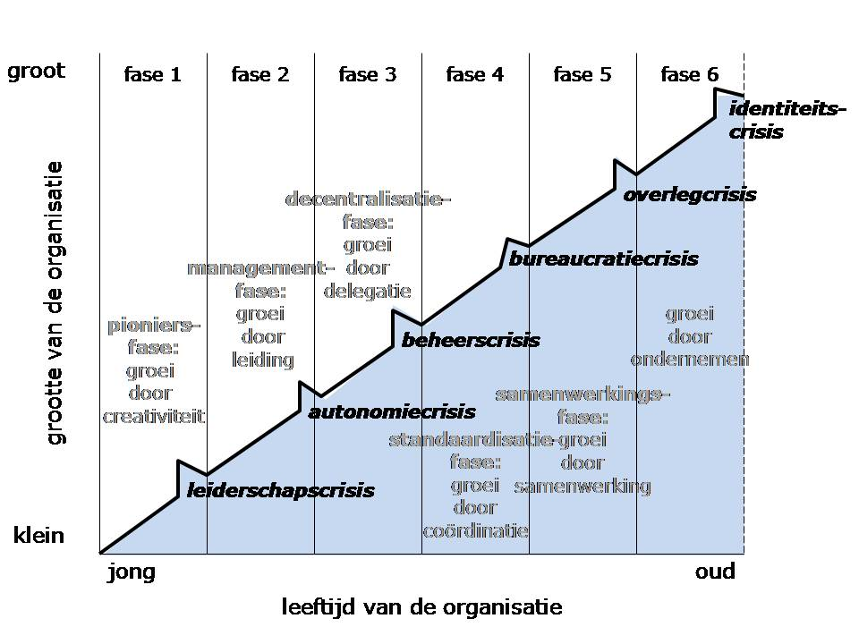
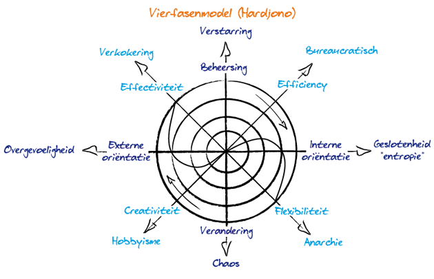

# Greiner

> Hoofdstuk 20

Elke organisatie heeft een levenscyclus. Greiner heeft bepaald dat er 6 fasen zijn die elke organisatie doormaakt. Elke fase word afgesloten met een crisis. Organisaties kunnen anticiperen en voorbereiden op de aankomende crisis.

## Fase 1

- Groei door: creativiteit
- Fase: pioniersfase

Pionere, vakmanschap, flexibiliteit, gedrevenheid en informaliteit. Iedereen kent iedereen. Start-ups. 

### Crisis 1 - leiderschapscrisis
De leidinggevende is niet veranderd, wel is de organisatie gegroeid waardoor hij of zij niet iedereen meer kan zien, inlichten, horen. Medewerkers krijgen het gevoel dat de leidinggevende minder bereikbaar is voor de medewerkers en veel alleen doet.

## Fase 2

- Groei door: leiding
- Fase: managementfase  

Formeel leiderschap, organisatiestructuur, financiele verantwoordingssystemen(bv. budgetten). Hierdoor wordt het leiderschap formeler,decommunicatie formeler, krijgt men een meer onpersoonlijk karakter, de eerste rechterhanden verschijnen. "Vroeger was het beter".

### Crisis 2 - autonomiecrisis
Tijd gaat verloren doordat er door hiërarchische niveaus word gecommuniceerd. Alles gaat nog via de centrale hiërarchie en dit leidt bij de rechterhanden tot frustratie: zij zijn meestal heel goed op de hoogte, maar mogen niets (de sandwichfunctie). 

*Er is roep naar meer autonomie*

## Fase 3 
- Groei door: delegatie
- Fase: decentralisatiefase

Een delegatie van verantwoordelijkheden, middenmanagement krijgt duidelijke taken en verantwoordelijkheden, een eigen motivatiesysteem, management/ bedrijfsleiding grijpt enkel in waar echt nodig (management by exception). kleinere teams, ieder team krijgt meer vrijheidsgraden

### Crisis 3 - beheer crisis
teams ondernemen actie, verbeteren, veranderen, maar allemaal wat los van elkaar, zonder algemene lijn. Het management heeft moeite om het te overzien. Het management reageert hier op door te centraliseren maar het bedrijf is te groot geworden hiervoor.

## Fase 4 
- Groei door: coordinatie
- Fase: standaardisatiefase

De introductie van betere coördinatiesystemen: men stemt het werk van afdelingen meer op elkaar af. Meer standaarden. Meer planning. 

### Crisis 4 - bureaucratiecrisis
De complexe en grote structuur die men tracht werkbaar te houden door een groot geheel aan regels en procedures. Men rijdt zich vervolgens vast in deze berg bureaucratie

## Fase 5 
- Groei door: samenwerking
- Fase: samenwerkingsfase

De uitbouw van interpersoonlijke samenwerkings-verbanden

### Crisis 5 - overlegcrisis
Door een samenwerking tussen de verschillende afdelingen vinden veel overlegmomenten plaats, om alle activiteiten op elkaar af te stemmen. Deze overlegmomenten zijn tijdrovend, hierdoor ontstaat een overlegcrisis.

## Fase 6 
- Groei door: ondernemen
- Fase: ondernermerfase

Medewerkers worden geacht ondernemers te worden die zelf initiatieven nemen.

### Crisis 6 - identiteitscrisis
Door eenzijdige nadruk op resultaten voelen mensen zich een nummer en ontstaat een ‘sociale identiteitscrisis’
## Vierfasen model van Hardjono

Het model van Hardjono word gebruikt om de huidige organisatie te analyseren en vast te stellen wat de organisatorische controlepunten zijn en welke interventies gepleegd moeten worden in lijn met de strategie.
Er zijn van 4 verschillende cirkels. Van binnen naar buiten zijn dit:
- Materieel
- Commercieel
- Sociaal
- Intellectueel

Organisaties kunnen hun doelstellingen bereiken door te kiezen voor een bepaalde oriëntatie: intern of extern, en control (beheersing) of verandering. Het is niet mogelijk alle oriëntaties tegelijk evenveel aandacht te geven, maar combinaties van niet-tegengestelde oriëntaties zijn wel mogelijk.  Zo ontstaan vier mogelijke strategische keuzes:

- Innovatie
- Markt
- Productie
- Lean

In het ideale geval zou een organisatie doelstellingen hanteren voor alle vier de keuzes: effectiviteit, efficiency, flexibiliteit en creativiteit. Organisatie-ontwikkeling kenmerkt zich echter juist door het feit dat gedurende een bepaalde tijd de nadruk ligt op één van de vier keuzes en de overige drie minder aandacht krijgen. Er is volgens Hardjono bovendien een ideale volgorde van die vier keuzes die ontwikkelingsfasen vormen (vandaar de benaming ‘vierfasenmodel’):

- Het idee (_innovatie_)
- Vermarkten (_markt_)
- Organisatie (_productie_)
- Herorientatie (_lean_)

