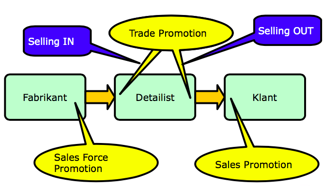
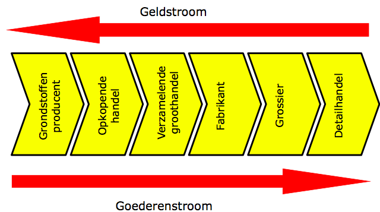
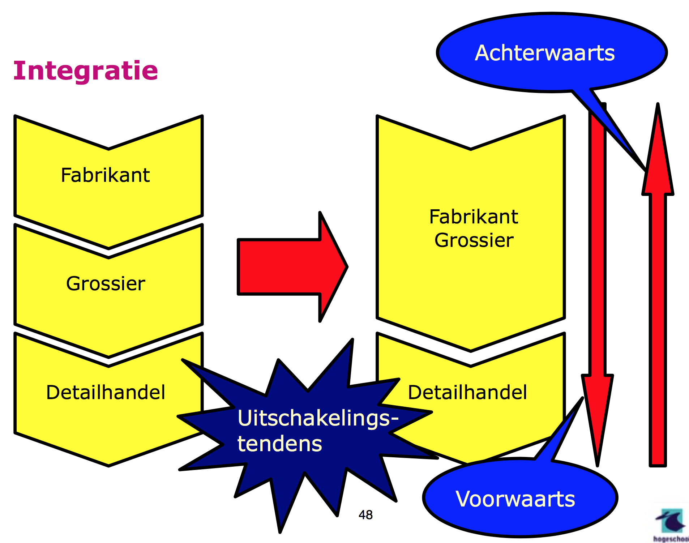
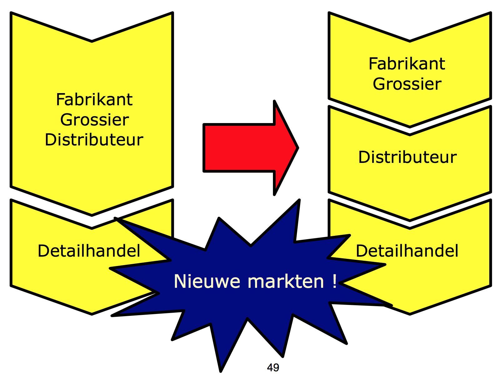
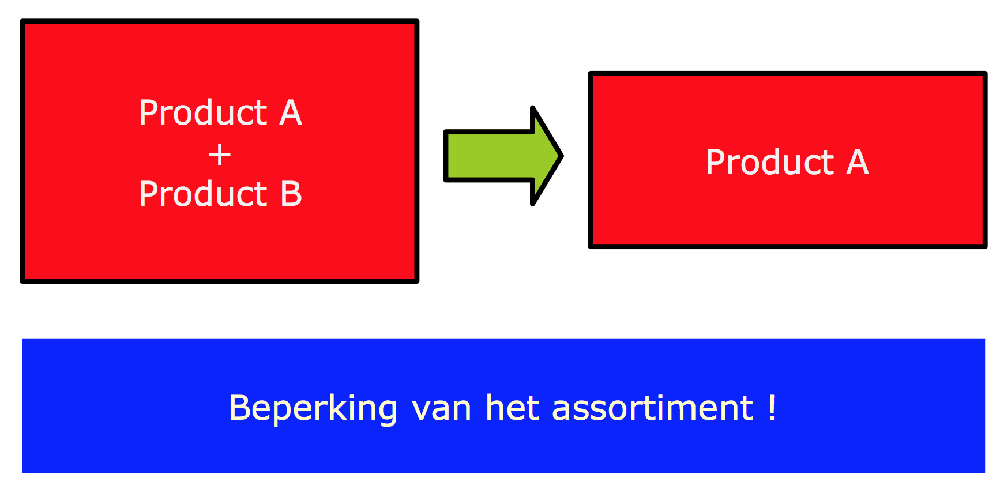
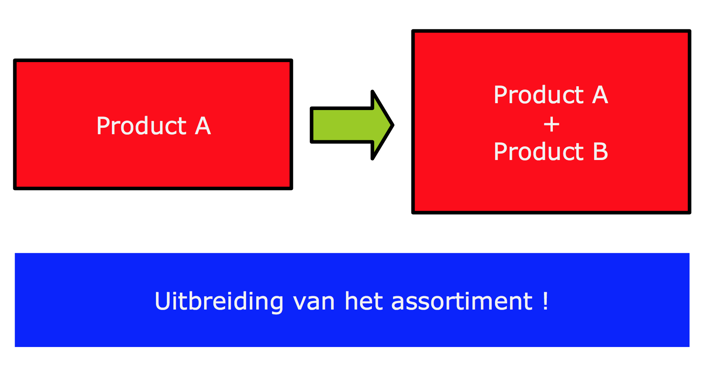

# Promotie,plaats,distributieenkanalen

<!-- toc -->

## Promotie
> Promotie is het onder de aandacht brengen van een nieuw of bestaand product of service met als doel de omzet positief te beïnvloeden. 

Onder promotie vallen onder andere:
- Reclame 
- PR 
- Promotions van product/dienst

### Reclame
> Reclame is overredende commerciele communicatie over producten en organisaties waarbij tegen betaling gebruik wordt gemaakt van massamedia en waarvan het doel is de kennis en attitude en waar mogelijk het gedrag van de doelgroep in een voor de adverteerder gunstige richting te beinvloeden.

Een aantal reclame technieken zijn:
- Herhaling 
- Groepsgeest
- Associatie
- Slogans
- Teasing 
- Buzzen 
- Virals
- Narrowcasting

> **PR** is het bevorderen van het begrip tussen de organisatie en de publieksgroepen. Daartoe wordt gebruikgemaakt van interne en externe communicatie om een bepaald publiek te informeren of te beïnvloeden met behulp van tekst, advertenties, publiciteit, promoties en speciale gebeurtenissen.

> **Direct marketing** is een Engelse term voor reclame maken voor producten door potentiële klanten direct en persoonlijk te benaderen.

Een aantal kenmerken zijn:
- Rechtstreeks contact
- Gericht op structurele tweezijdige communicatie
- Gegevens worden opgeslagen van het contact
- Meetbare respons
- Er is geen sprake van oogcontact
- Door het gerichte aanbod en directe contact is er een grotere kans de klant een goed aanbod te kunnen doen.

Direct marketing is meetbaar omdat er gegeven gebruikt en verzamelt worden van potentiele klanten. Het bouwt een langdurige relatie met de klant op. 

### Persoonlijke verkoop

> Persoonlijke verkoop is een promotiemethode waarbij een organisatie een partij (accountmanager of verkoper) inzet om persoonlijke relaties op te bouwen met als doel toegevoegde waarde voor beide partijen te realiseren. Aan de verkopende kant zal deze extra waarde vaak financieel zijn, terwijl aan de kopende kant de waarde een combinatie is van het persoonlijke contact en het consumeren van het product.

| Voordelen | Nadelen |
|---------------|-------------|
| Persoonlijke boodschap | Lage snelheid |
| Meer items behandeld worden | Hoog kosten per contact  |
| Klant kan vragen stellen |  |

Persoonlijke verkoop is geschikt als de klant overtuigd moet worden of als er een demonstratie aan te pas moet komen. Ook als het om hoge bedragen gaat dan willen klanten zelf als graag met een persoon de verkoop geregeld hebben bijv. een auto of huis.

Er zijn 2 verschillende formules die het aantal verkopers dat nodig is berekent.

**Formule van Talley**
$$
verkopers = \frac{klanten * gem. bezoeken per jaar}{bezoeken per verkoper per jaar}
$$

**Formule van Franke**
$$
vertegenwoordigers = \frac{klanten * bezoeken per jaar (reis + wacht +gesprekstijd)}{uren * dagen  per jaar}
$$

### Verkooptechnieken
#### VOCATIO
> Bij het voeren van een klantgesprek is het handig het model VOCATIO te gebruiken, ontwikkeld door Wage in 1970. De eerste letters van dat woord staan voor de volgende gespreksfasen:

- **V**erkenning (problemen, behoeften) 
	- Kennismaken
	- Verken de behoefte van de klant door vragen te stellen.
	- Je vraagt wat de klant wenst.
- **O**mschrijving (van problemen in woorden klant)
	- Je geeft het probleem van de klant weer
	- Samenvatten van de wensen 
	- Controle of het verhaal klopt
- **C**onfrontatie (matchen eigenschappen product met behoeften)
	- Je presenteert het aanbod.
	- Je toont het product (demonstratie).
- **A**rgumentatie (verhoog perceptie waarde/oplossing)
	- Productkenmerken
	- Productvoordelen
	- Oplossing van het probleem van de klant
- **T**egenwerpingen
	- Luisteren
	- Onjuiste beweringen weerleggen
	- onderhandelen
- **O**rder 
	- De kooptransactie vindt plaats 

### Promotions

Er zijn 3 soorten promotions
- Sales Force Promotion
	- De sales personen motiveren om de verkoopcijfers omhoog te gooien.
- Trade Promotion
	- Deze soort promotie richt zich op retailers en wholesalers. Dit gebeurt door middel van speciale kortingen 
- Sales Promotion
	- Deze soort promotie richt zich op de klanten. Dit gebeurt door middel van  kortingen, incentives, coupons.

Selling In
- De producent helpt verkopen aan de aan de volgende schakel in de verkoop ketting.

Selling Out
- Het typische verkopen aan de volgende schakel in de bedrijfskolom. Nadruk ligt op verkooptechnieken.

## Plaats

- De plaats in de valuechain
- De fysieke of virtuele locatie waar de goederen worden
aangeboden
- De organisatie van de goederenstroom

### Plaats integratie
> Er worden een of meer schakels uit de waardeketen weggenomen, doordat ergens iemand er wat bij pakt. Daardoor ontstaat voor deze 'erbijpakkende partij' ruimte en kan hij het het geld, dat eerst door een ander in de keten werd verdiend, zelf benutten. Hij krijgt er natuurlijk wel werkzaamheden en verantwoordelijkheden bij. Zijn assortiment wordt groter (vanwege de extra werkzaamheden). Er kan voorwaartse of achterwaartse uitschakeling plaatsvinden. Voorwaarts is met de goederenstroom meebewegend erbij pakken. Achterwaarts is in omgekeerde richting.

### Plaats differentatie
> Er ontstaan nieuwe schakels in de waardeketen, die zich specialiseren en waarbij nieuwe markten worden aangeboord.

### Plaats specialisatie
> Bij specialisatie worden producten samengevoegd. Daarbij treedt dus een beperking op van het assortiment.

### Plaats paralellisatie (productontwikkeling)
> Producten worden gesplitst. Uitbreiding van assortiment

## Distributie
> Distributie overbrugt plaats- tijd en hoeveelheidsverschillen tussen producent en afnemer.

## Kanaalstructuren

> Kanaalstructuren beschrijven de manier waarop een fabrikant of verkopend bedrijf producten en diensten bij de klant aflevert.

