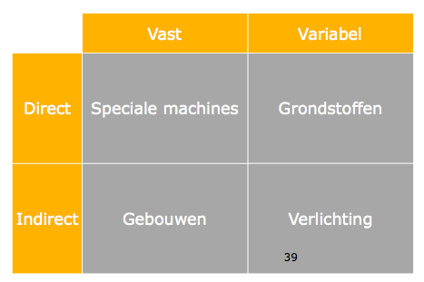

# Kosten, (prijs)strategieën, prijselasticiteit, winst

<!-- toc -->


# Prijs
Klant: datgene wat de klant betaalt om het product of dienst geleverd te krijgen
Bedrijf: Datgene wat het bedrijf binnen krijgt aan omzet

## Functies van "prijs"
- Rantsoeneringsfunctie
	- Consument kan niet alles kopen.
- Evenwicht
	- De prijs is het overeengekomen bedrag dat een consument wil betalen en wat een aanbieder wil ontvangen voor de levering van een bepaald product of dienst.
- Vergelijkingsmaatstaaf
	- Producten met een hogere prijs worden in het algemeen door de consument beoordeeld als “beter” of “betrouwbaarder”.

## Prijsstrategieën 

| Actief prijsbeleid | Passief prijsbeleid |
| --------------------- | ------------------------- |
| Skim pricing | Kartelvorming |
| Stay-Out pricing | Me-Too pricing |
| Put-Out pricing |  |
| Prijsdifferentiatie |  |
| Prijsdicriminatie |  |
| Penetratie pricing |  |

### Actief prijsbeleid

#### Skim pricing  


Het beetje bij beetje verlagen van de prijs om zodoende de markt af te romen. Ook wel de kaasschaafmethode genoemd. Deze methode kan alleen worden toegepast in een monopolie-positie

#### Stay-Out pricing

Stay out betekent ‘blijf weg'. Door de bestaande aanbieders op de markt worden de prijzen zo laag gehouden dat het voor nieuwkomers niet interessant is te investeren om zich op deze markt te begeven.

#### Put-Out pricing

Put out betekent ‘druk weg'. Een op de concurrentie gerichte prijsstrategie, waarbij de marktleider zijn prijs -tijdelijk- sterk verlaagt om kleinere concurrenten uit de markt te dwingen.

#### Prijsdifferentiatie

Van prijsdifferentiatie is sprake als dezelfde leverancier op basis van onderhandelingen verschillende prijzen vraagt aan verschillende klanten. Bijvoorbeeld als een fabrikant van diervoedsel voor zijn producten aan supermarkten een lagere prijs vraagt dan aan dierenwinkels en dat bijvoorbeeld verpakt als kwantumkorting.

#### Prijsdiscriminatie

Van prijsdiscriminatie is sprake als dezelfde leverancier verschillende prijzen vraagt op verschillende markten op grond van uiteenlopende afzetsituaties. Voorwaarde hiervoor is dat de markten gescheiden zijn, zodat de goederen niet via een omweg van de ene markt naar de andere stromen..

#### Penetratie pricing

Penetratiepricing is een techniek waarbij een prijs wordt gevraagd die (ver) beneden die van de concurrenten ligt. Voordelen zijn het snel verhogen van de omzet alsook het verkrijgen van naamsbekendheid en marktaandeel.

## Passief prijsbeleid

### Kartel
Een economisch kartel is een overeenkomst tussen bedrijven die bedoeld is om de onderlinge concurrentie te verminderen.

### Me-Too pricing

Met name bij oligopolie (enkele grote spelers op de markt) probeert men prijsconflicten te vermijden. Er vindt dan non-price competition plaats. De prijzen tussen de verschillende leveranciers verschillen weinig tot niets.

## Prijselasticiteit

$$
prijselasticiteit = \frac{\Delta Vraag (in \% )}{\Delta Prijs (in \%)}
$$


Voorbeeld:
Bij een prijs van E 5,- per stuk worden 10.000 stuks verkocht. Na een prijsverhoging tot E 5,50 worden nog slechts 7.000 stuks afgezet.

$$
PE = \frac{dV(\%)}{dP(\%)} = \frac{-30\%} {+10\%} = -3
$$

Hoe hoog wordt de prijs als er 15.000 stuks verkocht moeten worden?

$$
PE = -3 = \frac{dV(\%)}{dP(\%)} = \frac{+50\%}{dP(\%)} -> dP(\%) = \frac{+50\%}{-3} = -17\% 
$$
$$
P = 5 * (1-0.17) = 5 * 0.83 = 4.15 Euro
$$

# Kosten
> **Vaste kosten** zijn kosten die NIET reageren op een verandering in de hoeveelheid bedrijfsactiviteiten

> **Variabele kosten** zijn kosten die DIRECT reageren op de verandering in de hoeveelheid bedrijfsactiviteiten

- Proportioneel: de variabele kosten stijgen evenredig met de toename van de productie.
- Progressief: de variabele kosten stijgen harder dan de toename van de productie
- Degressief: de variabele kosten stijgen minder hard dan de toename van de productie

Van **directe kosten** kan zondermeer gezegd worden voor welk product zij zijn gemaakt. Bij **indirecte kosten** is die samenhang niet overduidelijk.



# Integrale kostprijs
$$
Kostprijs = \frac{C}{N}+\frac{Vn}{N}
$$
```
N = normale productie
C= totale constante kosten
Vn = totale variabele kosten bij normale productie
```

$$
Kostprijs = \frac{C}{N}+\frac{Vw}{W}
$$
```
N = normale productie
C= totale constante kosten
Vw = totale variabele kosten bij werkelijke productie
W = werkelijke productie
```
**Winst**
> Winst is het positieve verschil tussen opbrengst en kosten. Is het verschil negatief dan is er sprake van verlies.