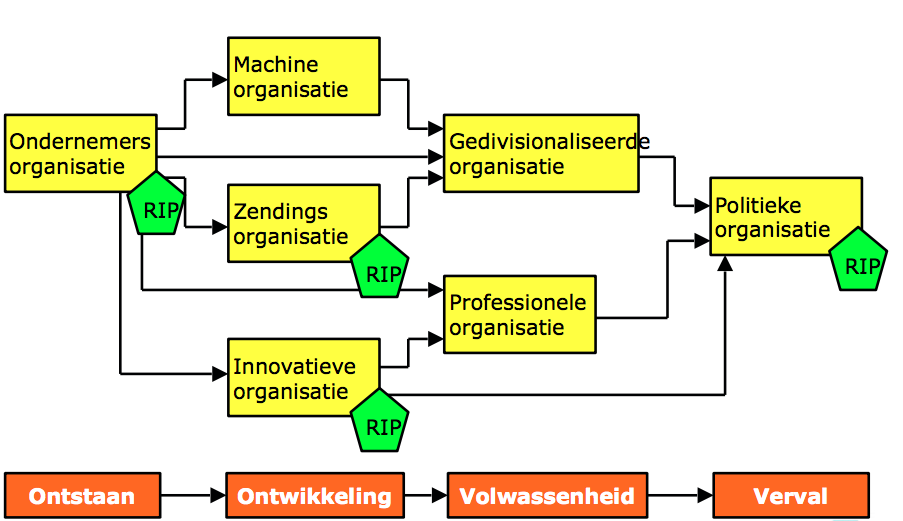

# Valuechain,Mintzberg,contingentie,levenscyclus

> Hoofstuk 15, hoofdstuk 19, hoofdstuk 20

<!-- toc -->

## Valuechain of porter 

Michael Porter ontwikkelde een belangrijk instrument voor het vinden van manieren om meer klantenwaarde te creëren. De valuechain splitst een bedrijf op in negen waardegenererende activiteiten.

Primaire activiteiten:
 - inkomende logistiek: afstemming product, aanleveren grondstoffen
 - operationele activiteiten: productontwikkeling
 - uitgaande logistiek: distributie van resultaten
 - marketing en verkoop: marktonderzoek, reclame
 - service: klantenservice, garantie, reparatiedienst

Ondersteunende activiteiten:
 - infratructuur: begroting, boekhouding
 - human resources management/personeel: werving, training
 - technologie ontwikkeling: ict voorzieningen
 - inkoop: marktonderzoek, verwerving goederen.

## Mintzberg  

Mintzberg heeft bepaald dat een organisatie bestaat uit verschillende onderdelen

### Configuraties

 - De strategische top (het top-management).
 - Het midden management. Deze voert het beleid uit van het top-mangement met in acht nemend de wensen van de operende kern.
 - De opererende kern. De mensen die de producten maken of diensten leveren.
 - De technische structuur(IT, en logistieke planning).
 - De ondersteunende staf (administratie, finance, cafetaria).

--- 

Mintzberg heeft bepaald dat er 5 configuraties zijn van een organisatie. 
- Ondernemersorganisatie 
	- meeste macht bij de top
	- weinig regels en procedures 
	- weinig staf, plaate informele organisatie 
	- familiecultuur
	- informatie loopt vooral van en naar de top

---

- Machineorganisatie 
	- routinematig
	- sterke hierarchie en technostructuur
	- veel regels en procedures
	- stabiele omgeving
	- piramide cultuur

---

- Professionele organisatie
	- hoogopgeleid
	- belangrijke rol zelfstandige proffessionals
	- grote ondersteunende staf
	- technostructuur is beperkt. regels komen vaak van buitenaf
	- geoliede machine structuur

---

- Innovatieve organisatie 
	- jong flexibel
	- projectmatig werken
	- onduidelijke taakverdeling
	- veel onzekerheid en politiek
	- medewerkers hebben vaan laptops met allerlei ‘freeware’

 

---

- Gediversificeerde organisatie
  - binnen bedrijf onderverdeling naar producten of markten
  - belangrijke rol middenkader: aansturing van de divisies

---

Een zendings organisatie staat ideologie voorop. Management staat dicht bij de uitvoering. Hierbij kan je denken aan WNF die dieren over heel de wereld helpt. Een politike organisatie draait het om macht. Dit zijn zowel politieke partijen als regeringen. 

Elke onderdeel van een organisatie heeft zijn eigen belangen. 

- *De strategische top* wilt graag centralizeren. Het belang ligt erbij om de organisatie zoveel mogelijk samen te voegen en optimaal overzicht te houden.
- *Support* wilt graag de samenwerking bevorderen intern en met externe belanghebbenden. 
- *Technische structuur* wilt graag standaarden. Door internationale standaarden te gebruiken zoals ITIL, ASL of BiSL.
- *De opererende kern*  wilt graag professionalisering. Het steeds beter realiseren van dagelijkse werkzaamheden.
- *Lijn management* streeft ernaar om te balkaniseren. Ze streven ernaar om verschillende groepen te plezieren. 

>Contingentietheorie: Het gedrag van de medewerkers uit zich op een bepaalde manier en dat wordt bijv. ervaren als stimulerend of juist demotiverend. Dit gedrag is het gevolg van wat er in de organisatie is gebeurd. Het staat dus niet op zichzelf.

