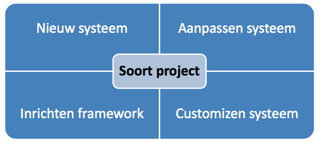
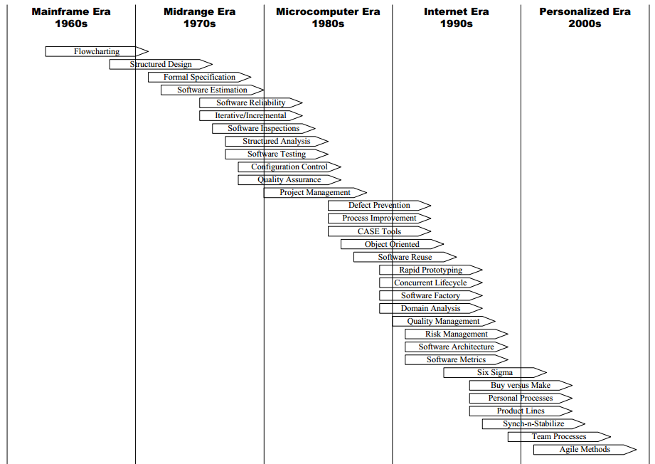
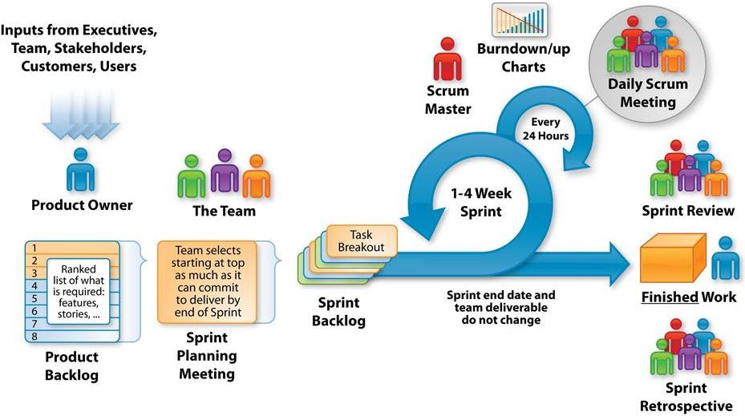

# Software Ontwikkelmethoden

<!-- toc -->

De IT wereld:
- Complexiteit van producten en aanbieders
- Snelle veranderingen
- Kennis is nog steeds schaars
- Eigen terminologie

Een IT project kan op verschillende aspecten betrekking hebben:

Top 5 oorzaken voor problemen bij projecten: 

- Eisen - "Interpretatieverschillen = communicatie"
	- Onduidelijk
	- Geen overeenstemming
	- Geen prioriteit
	- Tegenstrijdig
	- Onnauwkeurig
- Mensen - "Techniek blijft mensenwerk"
	- Onvoldoende resources
	- Conflicten, fouten, bugs
- Deadlines - "Overfixeren van projectonderdelen"
	- Te strak
	- Onrealistisch
- Planning - "Projectplanning is een levend iets"
	- Slecht geschat
	- Te weinig informatie
- Risico's - "Bad risk management"
	- Niet geïdentificeerd

## Software ontwikkelmet
> Wat is een softwareontwikkelmethodiek? Een softwareontwikkelmethodiek is een gestructureerde manier van werken. Gedocumenteerde manier van werken. Keuze sluit aan bij project.

Typen Software ontwikkelmethode:
- Linear
	- Afgebakende fases die na elkaar opvolgen
	- Geen 'loop' naar eerder fases
	- Meestal big bang invoeren. 
- Incrementeel
	- Werkende eenheden (incrementen, pilots)
	- Functionaliteit groeit geleidelijk
- Iteratief
	- Feedbackloops op tussenversies (prototypes)

### History

### IAD
Bij Iterative application development, oftwewel IAD, zijn er 3 fasen. Definitiestudie, pilotontwikkeling en invoering. Deze 3 fasen worden iteratief uitgevoerd. 

#### Definitiestudie
In de eerste fase worden de doelen van het te ontwerpen systeem onderzocht en beschreven. Beperking en randvoorwaarden worden genoteerd. Als er al een pilot is afgerond (als er al een vorige iteratie is geweest) dan word de pilot geëvalueerd. Bij elke cycli van ontwikkeling wordt het uiteindelijke plan steeds verder uitgewerkt en uitgedetailleerd. De wens van het systeem word steeds duidelijker.

#### Pilotontwikkeling
In de tweede fase word er begonnen met de ontwikkeling van de pilot. Er kan 1 pilot of meerdere pilots kunnen tegelijkertijd worden uitgevoerd. Er worden workshops gehouden voor het pilotontwerp en pilotontwikkeling. Tijdens de pilotontwerp workshops wordt er gekeken hoe de globale functionele specificaties van de in aanbouw zijnde pilot eruitzien. Er wordt een **prototype** gemaakt van het uiteindelijke systeem. Delen van de pilot of pilots worden hierna door één of meerdere ontwikkelteams gebouwd, zogenaamde **A-teams**. A-teams zijn kleine groepen goed samenwerkende professionals, die elk hun eigen specialisatie hebben en allemaal in fasen van de ontwikkelingcycli kunnen werken. Tegengesteld zullen gebruikers die betrokken zijn bij de ontwikkeling opereren in **U-teams**.

#### Invoering
In de derde fase worden de, in voorgaande fase ontwikkelde, pilot operationeel gemaakt en ingevoerd in de organisatie. Ervaringen die zijn opgedaan worden verzameld en opgeslagen voor de volgende pilot. 

#### Iteraties strategieën
- Evolutionair ontwikkelen
	- Alle fases worden uitgevoer en in z'n geheel in de iteratie meegenomen (Pijl van invoering -> defenitiestudie). Niet alle systeemeisen worden in 1 keer opgesteld. Niet geschikt voor fixed price projecten (Een Fixed Price contract is een soort contract , waar het te betalen bedrag is niet afhankelijk van de gebruikte middelen of tijd besteed) .
- Incrementeel opleveren
	- De eerste fase definitiestudie wordt dus eenmalig uitgevoerd. Dit in tegenstelling tot evolutionair ontwikkelen, alwaar die fase net zo vaak wordt uitgevoerd als de fasen pilot ontwikkeling en de invoering. (Pijl van inovering -> pilotontwikkeling). Handig bij duidelijke systeemeisen, weinig beschikbaarheid key users. 
- Incrementeel ontwikkelen (RAD)
	- Hetzelfde als incrementeel opleveren maar er wordt in één keer ingevoerd (pijl van pilotontwikkeling -> zichzelf). Heeft veel weg van Rapid Application Development. Snel ontwikkelen met minimum aan documentatie, veel workshops.
- Big-bang-invoeren
	- Hetzelfde als incrementeel opleveren maar er wordt in één keer ingevoerd (pijl van pilotontwikkeling -> zichzelf). Heeft veel weg van Rapid Application Development. Snel ontwikkelen met minimum aan documentatie, veel workshops.

#### Requirements
- Workshops met gebruikers
	- Multidisciplinair
		- Mensen met verschillende functies en rollen
	- Cross-functional
		- Mensen van verschillend afdelingen
	- Brainstorming
		- Echt brainstormen, probleemoplossend denken
		- Beeldvormen en documenteren
	- Systeemeisen worden geinventariseerd, gecategoriseerd en geprioriteerd.

### Scope creep
Tijdens het ontwikkelen kan het gebeuren dat de systeemeisen vervagen en dat de scope van het project groter word dat vooraf is vastgesteld. Hierdoor lopen projecten uit. 

### Timeboxing
Timeboxing is het vooraf beperken van de hoeveelheid tijd die men aan een bepaalde activiteit wil en mag besteden. Dit om te voorkomen dat iets uitloopt. Timeboxing wordt gebruikt als een methode om projecten te plannen. De planning bestaat uit een aantal verschillende perioden (timeboxes), met elk hun eigen producten, budget en deadline.

### Agile
Risico's verminderen door: 
- Adaptability: omgaan met veranderende omgeving van het project en dus de wensen en eisen van gebruikers.
- Flexibility: de snelheid van uitvoeren en het verbeteren van communicatie met als doel om de juiste balans te vinden tussen wat de klant en wat de business verwacht.

### Scrum

> Definition of Done: alleen dingen op de checklist die echt klaar zijn worden opgeleverd. (functionaliteit en kwaliteit)

### Extreme programming
> Een humanistische discipline van software-ontwikkeling, gebaseerd op de beginselen van eenvoud, communicatie, feedback, en moed.

De optimale kracht van XP komt voort uit het in samenhang toepassen van twaalf best practices van software ontwikkeling: 

- Feedback
	- Pair programming
	- Planning
	- Test Driven Development
	- EEN team
- Continu proces
	- Continue integratie
	- Refactoring
	- Korte iteraties
- Gedeelde kennis
	- Metafoor
	- Standaarden
	- De code is van iedereen
	- Eenvoud van ontwerp
- Welzijn van ontwikkelaars

### Wat ze uiteindelijk allemaal doen
- Requirements opstellen 
	- Met en door wie?
- Requirements prioriteren
	- **M**o**SC**o**W**
	- Cijfers
	- Basis, Comfort, Luxe (IAD)
- Requirements toetsen en vastleggen

## Tips om methodisch te werk te gaan
- Vind de ‘juiste’ mensen
	- Wie zijn de key users/champions?
	- Wie zijn de Subject Matter Experts (SME’s) (
- Houdt rekening met diverse ‘Gebeurtenissen’
- Bekijk bestaande documentatie
- Stel veel vragen
- Krachtig en helder documenteren