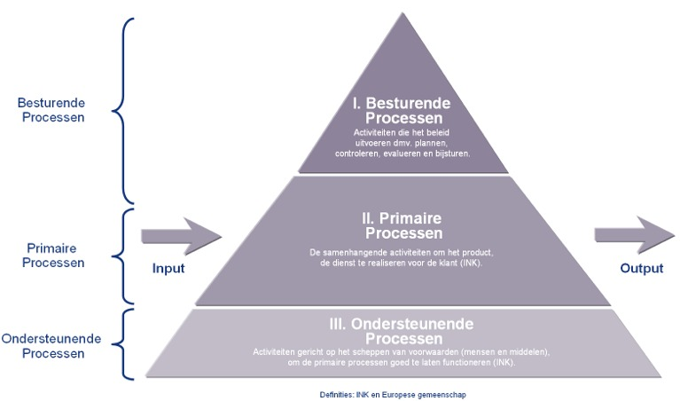
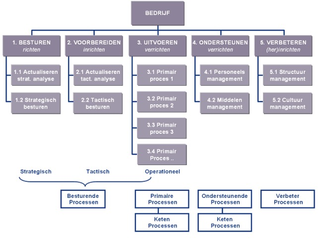
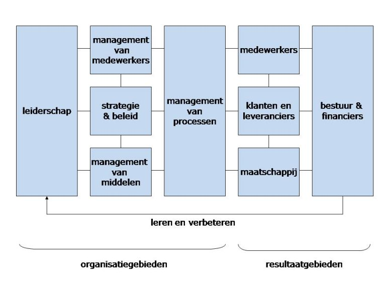
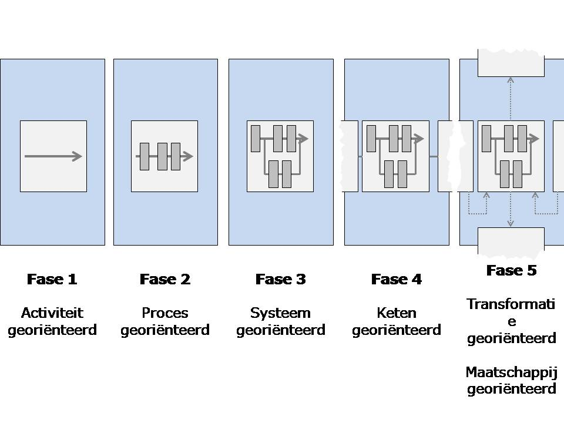
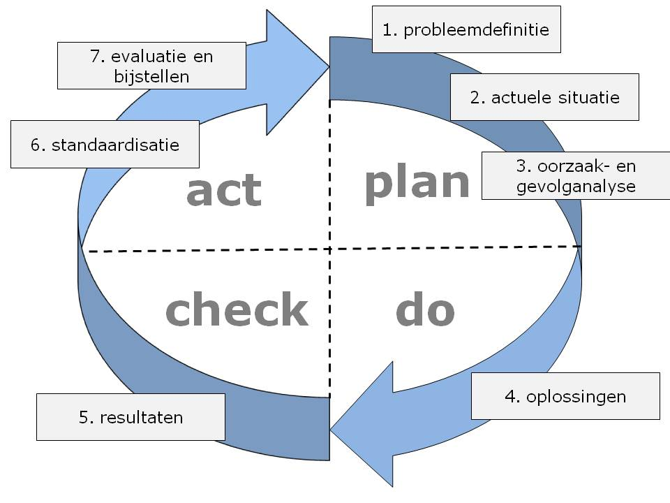
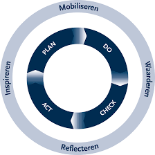

# Proces
> Standaard aanpak om iets te doen/maken, gedocumenteerd of herhaalbaar gedrag/aanpak. 

Combinatie van mensen, middelen, materialen, methoden en omgeving die voor bepaalde output zorgt (product, dienst).

> Kwaliteit van product komt voort uit kwaliteit van proces

Een ‘proces’ wordt nog te weinig gezien als een aanwinst (zoals producten of mensen/resources of eigendom van bedrijf)

## Soorten processen

#### Besturende processen
Besturende- of managementprocessen omvatten alle acitviteiten betreffende het plannen, controleren, evalueren en bijsturen. In een procesgerichte organisatie vindt besturen op strategisch, tactisch en operationeel niveau plaats. Daarnaast onderscheiden we nog de besturen van de procesontwikkeling zelf. Dit soort besturende processen worden verbeterprocessen genoemd.

#### Primaire processen
Primaraire processe (ook kern- of operationele processen genoemd) beschrijven de dienstverlening of het productieproces. Primaire processen lopen van klant tot klant. Voor een productiebedrijf zijn dat: productontwerp, productontwikkeling, de productie zelf en de logistieke distributiefunctie. Voor dienstverlenend bedrijf: intake, behandeling en nazorg.

#### Onderstudende processen
Ondersteunende processen zijn ondersteunend aan de primaire processen (uiteraard ook aan de besturingsprocessen zelf). Resultaat zijn mensen en middelen zoals informatie, faciliteiten en financien.

# Waarom een kwaliteits model?

> Standaard manier voor bepalen en meten kwaliteit. 

## Wat heb je nodig als je wilt weten wat de kwaliteit van een proces ?
Informatie over het proces
- Van welke kwaliteit zijn de resultaten van het proces?
- Welke kwaliteit zouden de resultaten **moeten hebben**?
- Wat is de kwaliteit van veranderingen en verbeteringen?
- Hoe zorgen we voor **Continuous Improvement**?

# Plan, Do, Check, Act
De **kwaliteitscirkel van Deming** is een hulpmiddel voor kwaliteitsmanagement en probleemoplossing. De cirkel beschrijft 4 activiteiten die op alle verbeteringen van toepassing zijn. De vier activiteiten worden iteratief doorlopen en zorgen voor een betere kwaliteit. PDCA dient als basis voor [INK](#ink) en [PMBOK](#pmbok)

## Plan
Kijk naar de huidige werkzaamheden en ontwerp een plan voor de verbetering ervan. Stel doelstellingen vast.

## Do
Voer de geplande verbetering uit in een gecontroleerde proefopstelling

## Check
Meet het resultaat van de verbetering en vergelijk deze met de oorspronkelijke situatie en toets deze aan de vastgestelde doelstellingen.

## Act
Bijstellen aan de hand van de resultaten uit voorgaande activiteit.

# INK

Het INK model geeft schematisch de tien belangrijkste aspecten van een organisatie in hun onderlinge verband weer. Om goed sturing te kunnen geven aan de organisatie dient het management aandacht te besteden aan elk van de 10 aandachtsgebieden.

**Kenmerken**
 - Leiderschap met lef
 - Resultaatgerichtheid
 - Continue verbeteren
 - Transparantie
 - Samenwerking

## Aandachtsgebieden
1. Leiderschap
2. Beleid en strategie
3. HRM
4. Middelenmanagement
5. Management van processen

Resultaatgebieden waarbij het gaat om:
6. Waardering door klanten
7. Waardering door medewerkers
8. Waardering door de maatschappij
9. Behaalde ondernemingsresultaten

In de vijf organisatiegebieden, de linker helft van het model, wordt weergeven hoe de organisatie is ingericht, gelet op de visie en de doelen van de organisatie. Ook wordt hier informatie aangereikt in welke richting de organisatie zich zou kunnen verbeteren. 

De vier resultaatsgebieden (de rechter helft van het model) geven weer wat de beoogde of bereikte resultaten zijn van de organisatie. De gedachte hierbij is dat een organisatie altijd resultaten bereikt voor een bepaalde doelgroep. Dat kunnen zijn: klanten, leveranciers en samenwerkingspartners, de eigen medewerkers, de maatschappij, het bestuur en de financiers (bijv. de overheid) van de organisatie. 

Het INK stelt in welk mate wil de organisatie tegemoet komen aan de wensen/verwachtingen/behoefte van de verschillende doelgroepen.

Het INK model word in 5 fasen onderscheiden
1. Activiteit georiënteerd
	- Kwaliteit centraal
2. Proces georiënteerd
3. Systeem georiënteerd
4. Keten georiënteerd
5. Transformatie georiënteerd

# IMWR en PCDA

De IMWR cyclus is nodig om de PDCA cyclus draaiend te krijgen. Elke stap uit de PDCA cyclus wordt verbonden met een werkwoord. Die weerspiegelen de aandacht die met name het management moet geven aan elke stap in de PDCA cyclus.

- Inspireren en plan 
	- Om de plannen te laten lukken moet management de medewerkers inspireren
- Mobiliseren en do
	- Zonder mensen te mobiliseren en te motiveren komt de uitvoering niet van de grond 
- Waarderen en check
	- Een sfeer van vertrouwen en veiligheid is nodig om elkaar aan te kunnen spreken op negatieve en positieve prestaties.
- Reflecteren en act
	- Het actualiseren en bijstellen van de plannen zal veel beter verlopen wanneer management en medewerkers vrijuit kunnen reflecteren

# PMBOK
**Project Management Body of Knowledge** is een poging om algemeen erkende projectmangement informatie en gebruiken te beschrijven en standaardiseren. Tijdens een project doorloopt het projectbeheer een periodieke cyclus van projectinitiatie, planning, uitvoering, controle & bijsturing en projectafsluiting. Een project dient volgens PMBOK te worden benaderd vanuit 10 verschillende aandachtsgebieden:

| Elements of managing projects  | Kennisgebieden                                                                                                                                                                   |
|--------------------------------|----------------------------------------------------------------------------------------------------------------------------------------------------------------------------------|
| Project Integration Management | Integratie. Ontwikkel het Project Contract, Scope Statement en Plan. Leid, manage, controller en beheers veranderingen in het project                                            |
| Scope management               | Werkingsgebied. Planning, Definitie, Work Break-down Structure (WBS) Creatie, Verificatie en Controle                                                                            |
| Time management                | Tijd. Definitie, volgordebepaling, Middelen en Duur prognose, Planningsontwikkeling en Planningscontrole                                                                         |
| Cost management                | Kosten. Middelen planning, Kosteninschatting, Budgettering, Controle                                                                                                             |
| Quality management             | Kwaliteit, Kwaliteitsplanning, Kwaliteitsbewaking en Kwaliteitsbeheersing (Controleren of het project tegemoet komt aan alle contractueel vastgelegde eisen van de opdrachtgever |
| Human Resources management     | Human Resources. HRM Planning, Aannemen, Ontwikkelen, en Managen van Projectteam                                                                                                 |
| Communications Management      | Communicaties. Communicatieplanning, Informatiedistributie, Prestatierapportage, Stakeholdermanagement                                                                           |
| Risk management                | Risico's. Risicoplanning en Identificatie, Risicoanalyse zowel kwalitatief als kwantitatief. Reactie's op risico's (acties)                                                      |
| Procuremanagement              | Inkoop. Aankoop en Inhuurplan, Reacties van verkopers en selectie. Contract administratie en contractafsluiting                                                                  |

Tijdens een project doorloopt het projectbeheer een periodieke cyclus van projectinitiatie, planning, uitvoering, controle & bijsturing en projectafsluiting. Een project dient volgens PMBOK te worden benaderd vanuit 10 verschillende aandachtsgebieden:

# CMMI

> CMMI is een framework voor procesbeheersing (dus geen standaard of norm zoals PMBOK en ISO)

De kwaliteit van het (te ontwikkelen) software systeem wordt sterk beïnvloed door de kwaliteit van het proces om dit systeem aan te schaffen, te ontwikkelen/inrichten en onderhouden. Je komt een heel eind met goede mensen, goede methoden en technieken en tools en materiaal (apparaten, hardware etc), maar zonder een goed proces komt de haalbaarheid en de mate van succes onder druk te staan.

Capability Maturity Model Integration (CMMI) geeft aan op welk niveau softwareontwikkeling van een organisatie zit. Je kun het ook de volwassenheid van de organisatie noemen. Ontwikkeld voor 3 branches. Development, Acquisition, Service

Verschillende niveau's:
1. Initial (Initieel)
	- Ad hoc probleemoplossen
	- Onbekend welke hulpmiddelen voor resultaat
	- Geen structuur voor verbetering
2. Repeatable (Herhalend)
	- Sprake van ontwikkeling
	- Informatie word gebruikt die eerder is opgedaan.
	- Er is sprake van kennis
3. Defined (Gedefineerd)
	- Processen zijn beschreven en onder controle
	- Processen kunnen verbeterd worden door kennis 
4. Managed
	- Procesbeheersing
	- Kwaliteit van proces kan worden gemeten
	- Proces kan worden bijgestuurd
5. Optimized (Geoptimaliseerd)
	- Verbeterpunten en actieplannen worden uitgewerkt en uitgevoerd

Aandachtspunten van CMMI zijn:
- Vaststellen op welk niveau een organisatie zich bevind. Met goede leiding kan de organisatie naar een hoger niveau.	
- Er kan geen niveau worden overgeslagen
- Meeste ondernemingen op niveau 3

## SCAMPI
Standaardmethodeomhetniveauvan procesverbetering te evalueren en vaststellen:

> Hoe goed is deze organisatie in het verbeteren
van hun processen?

Er zijn 3 klassen voor de striktheid waarop het niveau van procesverbetering wordt beoordeeld A, B en C. Daaruit volgt een lijst met conclusies, aanbevelingen en een rating over de volwassenheid van de organisatie.

### CCMI wel of niet?
- Kan samengaan met software ontwikkelmethodieken.
- Draagt bij aan de voorspelbaarheid, consistentie en herhaalbaarheid van processen.
- Niet het wiel opnieuw hoeven uitvinden
- Lerende organisaties
- Veel voorwaarden aan documentatie
- Geschikt voor grote organisaties

# LEAN

LEAN is een business strategie en een manier van werken waarbij alles en iedereen in de onderneming zich richt op het creeren van waarde voor de klant in alle processen. Verspillingen worden geelimineerd. Doordat de klant centraal staat creeer je maximale toegevoegde waarden voor de klant tegen minimale inspanning.

> Een Lean bedrijf is zich bewust van haar omgeving en wil niet alleen voor de klanten, maar ook voor de maatschappij waarde toevoegen.

Iedereactiviteitdiedevormoffunctievaneen product of dienst aanpast, creëert de waarde. Lean richt zich op het verwijderen van verspilling zoals afval, overschotten, restanten om kosten te besparen: remove non-value adding activities

## Muri
Er is sprake van **muri** wanneer er boven de capiciteit van een persoon of machine geproduceerd moet worden, oftewel **overbelasting**. 

## Muda
Met **muda** wordt elke activiteit bedoeld die beslag legt op resources maar geen waarde toevoegt voor de klant, oftewel **verspilling**. Er zijn 3 sorten groepen activiteiten;
- waardetoevoegende activiteiten. Die moeten behouden worden.
- niet-waardetoevoegende activiteiten. Die echter wel nodig zijn om aan externe en interne eisen te voldoen. Denk hierbij aan wet- en regelgeving en intern beleid. Die moeten verminderd worden.
- verspillingen. Die moeten geëlimineerd worden. 

Standaardvormen van verspilling zijn:

| Verspilling   | Beschrijving                                                                                                                  |
|---------------|-------------------------------------------------------------------------------------------------------------------------------|
| Overproductie | meer of sneller produceren dan de klant vraagt                                                                                |
| Overbewerking | Meer toevoegen aan het product of dienst dan de klant nodig heeft                                                             |
| Transport     | Tussen-, eindproducten, medewerkers en soms klanten worden verplaatst                                                         |
| Beweging      | De medewerker of de klant moet niet-waardetoevoegende handelingen uitvoeren om het product of de dienst op te kunnen leveren  |
| Wachten       | De medewerker of klant moet het product of de dienst stillegegn totdat een batchrun, collega of leverancier iets heeft gedaan |
| Correctie     | Aan product of dienst moet voor de tweede keer gewerkt worden omdat er de eerste keer iets fout is gegaan                     |
| Voorraad      | Buffers van hulpmiddelen, materialen en capaciteit die op dit moment niet gebruikt worden.                                    |
| Talen         | Inzetten van mensen op werk dat ze niet leuk vinden, hen niet uitdaagt of waarvoor ze de kennis en vaardigheden missen.       |

## Mura
De aanwezigheid van ongelijkheden binnen een proces heet mura. Een voorbeeld is grote tempowisselingen. Mura is te vergelijken met de uitspraak "hollen of stilstaan". Mura kan voorkomen worden door in te springen op productietijden en daar de capaciteiten op af te stemmen.

# Six Sigma

> Meten is weten

<!-- TODO verbeteren en aanvullen -->
Opdatagebaseerdekwaliteit-en procesverbeteringsmethode middels:
– Vermindering van variaties
– Verwijdering van restanten en ‘dingen overdoen’ 
– Optimalisatie van proces
– Procesbeheersing

Eenbeheersbaarprocesis: 
– Stabiel
– Accuraat
– Voorspelbaar

