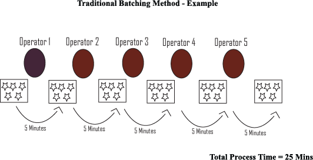
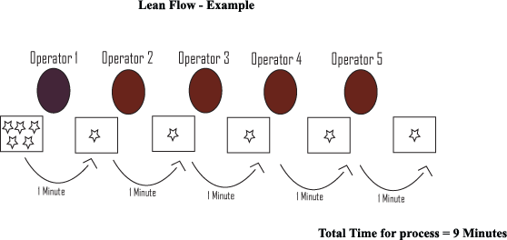
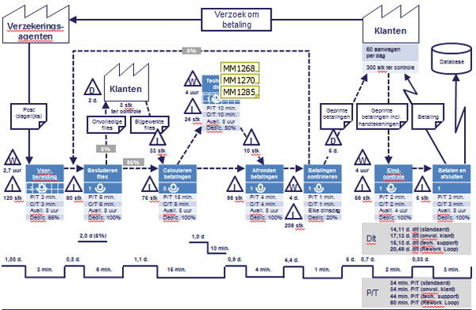
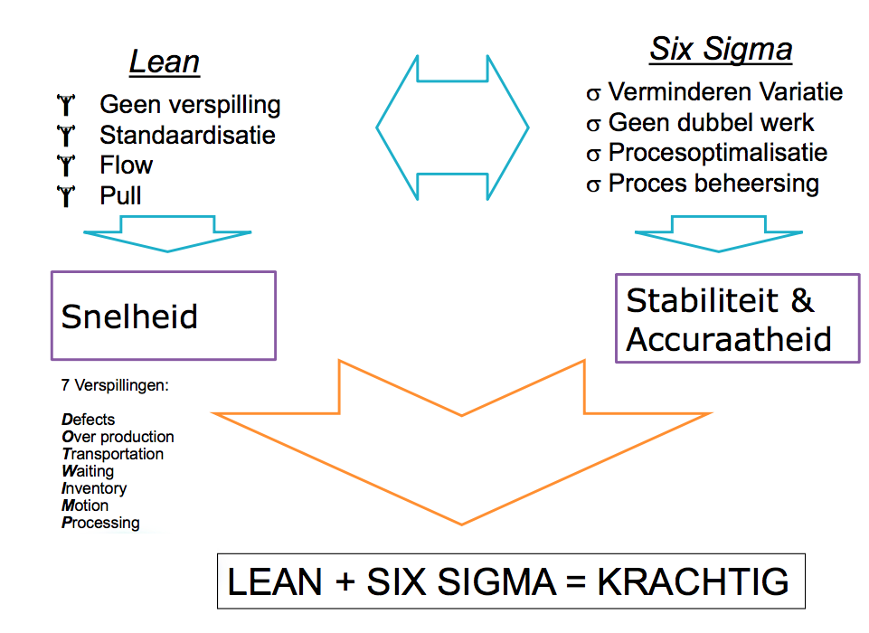
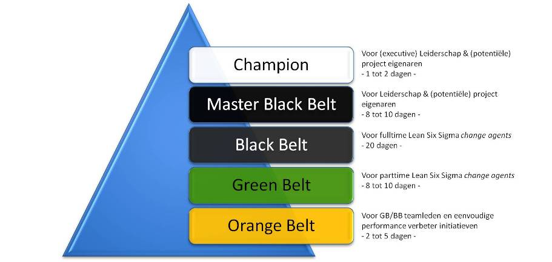

<!-- TODO chaotisch, doorlezen en refactoren en verder afmaken. Gestopt bij sheet 19-->

# Waarom dan toepassen in IT?

- Op proces niveau toch ‘winst’ te behalen met bepaalde tools uit LEAN Six Sigma
- Verbeterprojecten veelal een IT component
- IT productie: chips, laptops
- In combinatie met changemanagement meer succesvol

# Lean

## Tools van Lean

### House of Lean
"House of Lean" is een tool dat kan je helpen begrijpen in welke volgorde lean geimplementeerd moet worden. Een huis word gebruikt omdat het illustreert hoe de structuur gebouwd moet worden. 

> The foundation comes first, and the walls must be built before the roof can be put on. 

### Lean flow
> Flow is about increasing the throughput of work undertaken in the process, whilst improving quality and customer satisfaction.

De uitgangspunten van Lean Flow zijn de doorlooptijd te verkorten en met zo min mogelijk middelen.

> Om een voorbeeld te geven. Stel je voor dat iedere van handeling 1 minuut duurt en dat iedere partij van 5 items niet bewegen tot dat alle handelingen voor die ene proces stap zijn voltooid. Persoon 1 verwerkt 5 items in 5 minuten. Daarna gaat het naar de volgende persoon en dit doet er ook 5 minuten over. In totaal zijn er 5 personen voor het gehele proces en waardoor het proces 25 minuten duurt. 

### Takt Time
> Takt time is the average time between the start of production of one unit and the start of production of the next unit, when these production starts are set to match the rate of customer demand. 

### Lean roadmap
De 5 fasen om tot een lean-organisatie te komen zijn:  

|     Fase     | Beschrijving                                                                            |
|:------------:|-----------------------------------------------------------------------------------------|
| Value        | Datgene waarvoor de klant bereid is te betalen                                          |
| Value stream | De acties die uitgevoerd worden om een product of dienst aan de klant te kunnen leveren |
| Flow         | De flow van het proces                                                                  |
| Pull         | Signalen vanuit de hoek van de klant.                                                   |
| Perfection   | Proces perfectioneren. Streef naar perfectie                                            |

### Value stream map

> Een **"Value Stream Map"** wordt gebruikt om bedrijfsprocessen vast te leggen, te analyseren en te verbeteren. 

Een value stream map brengt alle stappen wat een bedrijf doet om een product af te leveren bij de klant. Van elke stap word opgeschreven welk materiaal en welke informatie daarvoor nodig zijn. 

Een voorbeeld van een map is:

### Samengevat
Lean betekent producteren en inkopen:
- Wat exact nodig is
- Wanneer het nodig is
- Geleverd waar nodig is

Bereikt door focus te houden op:
- 7 muda's
- Takt
- Flow
- Pull/kanban
- Perfectie

# LEAN en Six Sigma 
LEAN en Six Sigma samen leidt tot een wereldwijd bewezen en toegepaste methodiek verbetering van het bedrijfsresultaat aantoonbaar en duurzaam is. LEAN en SIX Sigma is een verzameling tools die de kwaliteiten van processen verbeteren door op zoek te gaan naar de oorzaak van fouten. LeanSixSigmareduceertdevariatiein productie en bedrijfsprocessen met als doel om producten en/of diensten in overeenstemming te laten komen met de verwachting die de klant heeft. Het is een management methode voor procesoptimalisatie. Lean Six Sigma is een combinatie van twee verbeter- methoden. Theoretisch levert dat processen op die niet alleen logistiek efficiënt (Lean) zijn, maar ook kwalitatief goed (Six Sigma)

- Operationele kosten terug brengen
- Klanttevredenheid vergroten
- Doorlooptijden verkleinen

## DMAIC fasering bij LEAN Six Sigma

| DMAIC stage | Lean Six Sigma                                                                                                      |
|:-----------:|---------------------------------------------------------------------------------------------------------------------|
| Define      | - Initiate the project - Define the process - Determine customer requirements - Define key process output variables |
| Measure     | - Understand the process - Evaluate risks on process inputs - Evaluate measurement systems                          |
| Analyze     | - Analyze data to prioritize key input variables - Identify waste                                                   |
| Improve     | - Verify critical inputs using planned experiments - Design improvements - Pilot new process                        |
| Control     | - Finalize the control system - Verify the long term capability - Close project                                     |

## Lean Six Sigma Belt structuur
Lean Six Sigma introduceren en implementeren vraagt om een complete en goed gestructureerde infrastructuur. Lean Six Sigma-projecten worden namelijk uitgevoerd door de mensen die er het meeste van weten: de eigen medewerkers. De benodigde infrastructuur voor een succesvolle Lean Six Sigma implementatie omvat een Championteam, een Master Black Belt, Black Belts, Green Belts en Orange Belts.

|       Teams       | Beschrijving                                                                                                                                                                                  |
|:-----------------:|-----------------------------------------------------------------------------------------------------------------------------------------------------------------------------------------------|
| Championteam      | Het championteam definieert en beoordeelt de Lean Six Sigmaverbeterprojecten, fungeert als strategisch leider en is verantwoordelijk voor het wegnemen van belemmeringen van de projectteams. |
| Master Black Belt | Verandermanager en inhoudelijk coach. Bied hoogwaardige kennis en kwaliteit als gereedschap voor projectteams. 1 voor 1000 medewerkers.                                                       |
| Black Belts       | Managen en controleren de projecten.                                                                                                                                                          |
| Green Belts       | Ondersteunen de Black Belts. 100 voor 1000 medewerkers                                                                                                                                        |
| Orang belts       | Basis van Lean Six Sigmaprogramma. Kennen en begrijpen verbeteren processe. Bron voor toekomstige Green Belts.                                                                                |

# Proces capability

> Het maakt niet uit hoe goed controle en test processen zijn, hoe meer fouten er ontstaan, hoe meer fouten er ontsnappen aan het proces naar de klant toe. In hoeverre kan het proces consistent de producten en services leveren, die aan de specificaties voldoen zoals vooraf gedefinieerd op basis van klantbehoefte?

# Six Sigma

