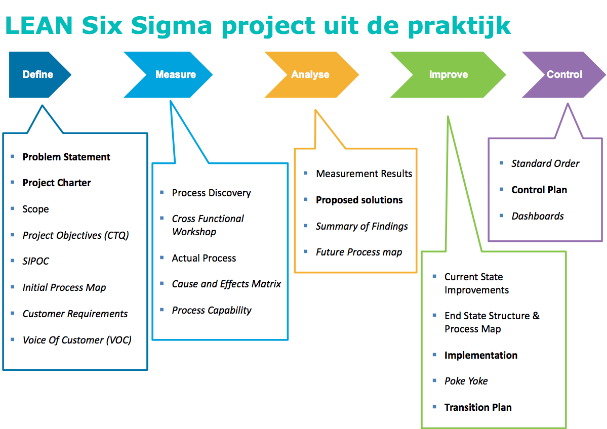
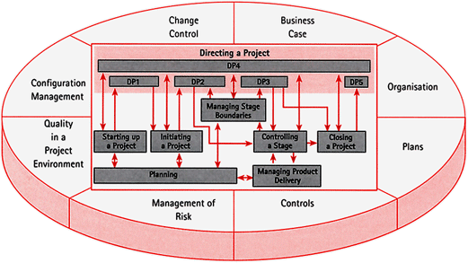

<!-- toc -->

# GOTIK
GOTIK is een methode voor het beheersen van verschillende aspecten van projectmanagement. De aspecten zijn geld, organisatie, tijd, informatie en kwaliteit. GOTIK word het meest gebruikt bij bouw projecten.

| Aandachtsgebieden | Toelichting                                                                                                                                                        |
|:-----------------:|--------------------------------------------------------------------------------------------------------------------------------------------------------------------|
| Geld              | Totaal aan financiële middelen voor realisatie project (projectdoelstellingen maar ook project kosten)                                                             |
| Organisatie       | Projectorganisatie in een schema ter verduidelijking van taken, verantwoordelijkheden en bevoegdheden van projectleden, bedrijven enzo.§                           |
| Tijd              | Het tijdsaspect van het project op zich en alle aspecten van tijd rond het project                                                                                 |
| Informatie        | Alle beschikbare informatie die voorafgaand aan het project, tijdens en achteraf aanwezig was, er van buiten af bij komt en binnen het project wordt geproduceerd. |
| Kwaliteit         | Het totaal aan kwaliteitskenmerken en kwaliteitswaarborgen (resultaten en project zelf)                                                                            |

## GOTIK project fasering
Een GOTIK project kent net als andere projecten een aantal specifieke stappen of fases. De meeste GOTIK projecten betreffen een bouwproject. De fases binnen zo een bouwproject zijn:

| Fase          | Bedoeling                                                                                                     |
|---------------|---------------------------------------------------------------------------------------------------------------|
| Initiatief    | Bedenken wat het project wel en wat het niet moet zijn; alle betrokkenen hebben een gelijk beeld              |
| Definitie     | Bedenken hoe het resultaat moet voldoen (eisen, wensen etc.)                                                  |
| Ontwerp       | Bedenken hoe het project er uit moet zien; een gedetailleerd uitgewerkte oplossing                            |
| Voorbereiding | Bedenken hoe het project er uit zal gaan zien; met een druk op de knop het het resultaat er vlekkeloos komen |
| Realisatie    | Uitvoeren, invoeren of maken van het project zodat het projectresultaat er ook helemaal is                    |
| Nazorg        | Gebruiken, beheren, onderhouden en vernietigen van het project                                                |

### GOTIK fasering en aandachtsgebieden

Binnen iedere fase worden de aandachtsvelden uit het GOTIK-Model meegenomen. Daardoor ontstaat een eenvoudig te hanteren kruistabel:

| GOTIK-methode | Geld | Organisatie | Tijd | Informatie | Kwaliteit |
|---------------|------|-------------|------|------------|-----------|
| Initiatief    |      |             |      |            |           |
| Definitie     |      |             |      |            |           |
| Ontwerp       |      |             |      |            |           |
| Voorbereiding |      |             |      |            |           |
| Realisatie    |      |             |      |            |           |
| Nazorg        |      |             |      |            |           |

# Communicatie

> ‘Effective communication means that the information is provided in the right format, at the right time, to the right audience, and with the right impact. Efficient communication means providing only the information that is needed’

GOTICK = GOTIK + Communicatie

Hoe kun je communicatie in een project manage?
- Afspraken communicatie: Communicatie plan, meestal een plan gericht op communicatie bij invoering/uitrollen project
	- Doelgroep
	- SMART doelstellingen
	- Boodschap
- Wat voor vergaderingen, rapportage, rollen?
- Tussentijds evalueren
- Communicatie training / teambuilding	

# RACI
Het RACI-model is een matrix die gehanteerd wordt om de rollen en verantwoordelijkheden van de personen die bij een project of lijnwerkzaamheden betrokken zijn weer te geven. 

| RACI        | Beschrijving                                                                                                                                                                                                 |
|-------------|--------------------------------------------------------------------------------------------------------------------------------------------------------------------------------------------------------------|
| Responsible | Degene die verantwoordelijk is voor de uitvoering. Verantwoording wordt afgelegd aan de persoon die accountable is.                                                                                          |
| Accountable | Degene die eindverantwoordelijk, bevoegd is en goedkeuring geeft aan het resultaat. als het erom gaat moet die persoon het eindoordeel kunnen vellen, vetorecht hebben. Er is slechts 1 persoon accountable. |
| Consulted   | Deze persoon geeft richting aan het resultaat, die persoon wordt voorafgaand aan beslissingen of acties geraadpleegd. Dit is tweerichtingscommunicatie.                                                      |
| Informed    | Iemand die geïnformeerd wordt over beslissingen, over de voortgang, bereikte resultaten enz. Dit is eenrichtingscommunicatie.                                                                                |

# DMAIC
DMAIC staat voor Define, Measure, Analyze, Improve and Control en is een methode die in de bedrijfswereld wordt gebruikt om Six Sigma-processen inhoudelijk te verbeteren. Het kan mogelijk iteratief gebruikt worden en richt zich op 1 probleem.

| DMAIC   | Beschrijving                                                                                                           |
|---------|------------------------------------------------------------------------------------------------------------------------|
| Define  | Stappen om project en proces te definiëren: Project Charter, Probleemdefinitie, Projectteam, SIPOC                      |
| Measure | Proces begrijpen middels data en performance metingen: Meetplan, Meetsysteem tests, data verzamelen, Process Capability |
| Analyse | Input- en output variabelen analyseren en verspilling en kansen identificeren                                           |
| Improve | Ideevorming, verbeteren, pilots draaien: Brainstorms, Uitvoeringsplan                                                  |
| Control | Borgen in organisatie: controle zodat toekomstige afwijkingen niet plaats vinden en toezicht op blijvende verbetering  |

## Define
- Is dit het goede project?
- Identificeer het probleem
- Project charter opstellen 
- Identificeer het proces waar het probleem zit
- Maak globaal overzicht van het proces
	- SIPOC
- Project charter herzien

### Probleemdefinitie
- Belangrijkste onderdeel van Project Charter; **Wat is het probleem?**
- Juist omschrijven om project succesvol te laten zijn
- Makkelijk te begrijpen
- Beschrijft de werkelijkheid
- Met doelstelling in meetbare termen
- **Probleemdefinitie bevat geen oplossing voor het probleem en ook geen oorzaken**

Een probleem definitie zou antwoord moeten geven op de volgende vragen:
- Welk soort problemen hebben we mee te maken? Welke problemen moeten we aanpakken: fouten, vertraging, dubbel werk, etc?
- Wanneer en / of waar doet het probleem zich voor?
- Is het probleem te groot gedefineerd?
- Bevat de eerste probleemdefinitie aannames en haastige conclusies?

Een project charter is de eerste stap bij alle kwaliteit methodieken, bij Lean en vooral bij Six Sigma. Het project charter definieert alle interacties van het project en de stappen voor een succesvolle afronding van het project. Het vindt plaats in de Define stap van de DMAIC, en het charter is essentieel voor een succesvol project. Een goed project charter zorgt voor succes door het definiëren van de nodige middelen, mensen en scope van het project, en een slecht projectcharter kan teamfocus, effectiviteit en motivatie verminderen.

- Project heeft een goed gedefinieerde:
	- Baseline = minimum
	- Goal = doelstelling
	- Entitlement = beste ooit behaald
- Voeg meetwaarden toe
- Bestaande KPI's gebruiken indien aanwezig
- Herzien wanneer dat nodig is

-----
- Wat is het probleem? Wie zijn de klanten die door dit probleem  benadeeld worden?
- Waar en wanneer doet het zich voor?
- Wat is de scope?
- Wat is de planning en wat zijn de kritieke fasen in het proces?
- Wie is mijn klant?
- Wat ga ik opleveren?
- Wat is belangrijk? Wensen en eisen.
- Wat valt binnen en buiten het project?
- Wie neemt deel aan het project?
- Wat levert het op?
- Hoe vatten we het samen?

## Measure
Als het probleem gedefineerd is, worden in de Measure-fase de relevante gegevens gemeten en verzameld. Hierbij zijn de volgende vragen van belang:
- Hoe groot is het probleem?
- Hoe zorg ik ervoor dat de informatie valide is?
- Welke informatie heb ik nodig en wat kan ik categoriseren?
- Hoe specifiek moet het zijn en hoe ga ik de informatie verzamelen?
- Wat heeft voorrang? 
- Welke gevolgen zijn er door het probleem?
- Welke data hebben we nodig?
- Is de data betrouwbaar?
- Hebben we detailkennis over het proces?

## Analyse
Nadat de gegevens gemeten en verzameld zijn, worden ze in deze fase geanalyseerd. Hierbij wordt onder andere geprobeerd om oorzaak-gevolgd relaties te herkennen. Verder wordt er in deze fase gezocht naar de volgende antwoorden:
- Wat lijkt het probleem te veroorzaken?
- Welke oorzaken kan ik bedenken?
- Welke prioriteiten stel ik voor nader onderzoek?
- Wat is de grondoorzaak van het probleem?
- Wat zegt de data?
- Zijn er bottlenecks of verspilling?
- Hoe kunnen we op basis van statistische gegevens weten hoe factoren zich van elkaar verschillen?
- Hoe kunnen we op basis van statistische gegevens weten of een factor significant is?
- Wat is het hoofdprobleem wat geadresseerd moet worden? Welke hoofdfactor moet worden aangepast?

## Improve
Als de grondoorzaken bekend zijn is het tijd om verbeteringen te bedenken, te testen en te implementeren. Veelal wordt in deze fase gebruik gemaakt van brainstormsessies. In deze fase is het van belang dat:
- De focus blijft liggen op de beste oplossingen
- De oplossingen worden getest in een pilot
- Indien de pilot succesvol is, de worden de oplossingen daadwerkelijk geïmplementeerd
- Wat adviseer je te doen? 
- Welke acties hebben prioriteit?
- Hoe kunnen we de nieuwe oplossing testen?
- Wat zijn de baten en wat levert het financieel op?

## Controle
Deze fase staat in het teken van borging, om terugval te voorkomen. Typische vragen in deze fase zijn:
- Hoe kan ik de resultaten borgen en daarmee terugval voorkomen?
- Hoe kan ik de ontwikkelingen visueel maken en vroegtijdig trends signaleren?
- Hoe moet ik reageren als het signaal er is?
- Wie worden beïnvloed door de verandering en hoe kunnen we zorgen voor verandering in gedrag?
- Zijn wijzigingen zo gedocumenteerd dat veranderingen in de organisatie geen impact hebben om verbeteringen?

# Wat is jouw methode?
- Gebruik je 'common sense'. 
- Communiceer  zelf helder en to the point
 - Bondige gespreks- meeting verslagen
- Follow up als onderdeel van je eigen werkwijze
 - Kom terug op je verzonden emails
 - Kom terug op inhoud eerdere meetings
- In het land der blinden is eenoog koning
 - Vertrouw op je eigen specialisme / kennis / kunde

---------------

# Prince 2 

 > **Pr**ojects **IN** **C**ontrolled **E**nvironments

 
 PRINCE2 is een methode voor projectmanagement. Deze methode is gericht op het management en de besturing en organisatie van een project. PRINCE2 is toepasbaar op alle projecten. Aspecten van de methode die niet van toepassingen zijn kunnen weggelaten worden.  De methode bestaat uit 7 principes, 7 thema's en 7 processen. De toepassing van de principes bepaald of iets een PRINCE2-project is, niet de strikte toepassing van de thema's of processen. 

 Een aantal kenmerken van Prince2 zijn:
 - Business Case
 - Client / Supplier
 - Non IT
 - Public domain
 - Best practice
 - Management by exception
 - Proces gericht
 - Product based planning
 - Geen ontwikkelingsfasering
 - Geen /weinig technieken
 
# Voordelen
## Algemeen
 - Herhaalbare methode
 - Methode die is te leren / over te brengen
 - Gebaseerd op ervaring
 - Zorgt er voor dat iedereen weet wat te verwachten, waar, hoe en wanneer
 - Vroegtijdig signalering van problemen
 - Is pro-actief en in staat om te gaan met plotselinge onverwachte situaties

## Voor de organisatie
- Beheerste manier van omgaan met wijzigingen met inachtneming van investeringen en ROI
- Actieve participatie van gebruikers en stakeholders gedurende het gehele project
- Een methode die onafhankelijk van het soort op te leveren producten te gebruiken is.

## Voor het project
- Beheerste start, uitvoering en afsluiting van het project.
- Frequente review van voortgang t.o.v. planning en Business Case
- Flexibele beslissingspunten.
- Afwijkingen van het plan worden 'automatisch' gesignaleerd.
- Betrokkenheid management en stakeholders op de juiste momenten tijdens het project.
- Goede communicatiekanalen tussen project, management team en de rest van de organisatie.
-  Overeenstemming over de gewenste **kwaliteit**

## Voor de projectmanager
- Heeft referentiekader voor de uitgangspunten met betrekking tot de start van het project
- Heeft een gedefinieerde structuur voor het delegeren, autoriseren en communiceren
- Kan het project opdelen in te managen 'stages voor beter planning
- Krijgt commitment van management voor in te zetten resources voordat de volgende  stage start
- Kan frequente managementrapportages opleveren
- Houdt vergaderingen met management en stakeholders tot het meest noodzakelijk beperkt

## Voor de gebruikers
- Duidelijke plaats in de projectorganisatie ten behoeve van beslissingen die genomen moeten worden
- Kunnen volledig betrokken zijn bij de dagelijkse voortgang
- Nemen deel in de quality checks gedurende het project
- Kunnen zeker stellen dat hun wensen ook daadwerkelijk worden uitgevoerd

## Voor senior management
- Management by exception
- Blijven volledig op de hoogte van status en voortgang

# Karakteristieken
- Eindig en vooraf gedefinieerde lifecycle
- Gedefinieerde en meetbare business producten
- Een overeenkomstige set activiteiten om die business producten te leveren
- Een gedefinieerde hoeveelheid resources
- Een organisatiestructuur met verantwoordelijkheden om het project te managen

# Aandachtsgebieden
- Organisation
- Plans
- Control
- Business Case
- Risk
- Quality
- Configuration Management
- Change Control

# Technieken
- Product Base Planning -- identificeer alle producten van het project om het doel te behalen en het werk dat daarvoor nodig is.
	- Product Breakdown Structure 
	- Product Flow Diagram
- Change Control
- Quality Review
- Project Document Management
	- Management Files
	- Specialist Files

# Producten 
- Product Outline:
	- Templates voor verschillende op te leverne management producten
	- Productbeschrijvingen

# Principes
* Zorg constant voor zakelijke rechtvaardiging
	* Gedurende het project een valide reden. De redenen worden getoetst aan de 'Business Case' die voortdurend geactualiseerd wordt. Voorkomen dat project doorgaat terwijl er geen baten meer te verwachten zijn.
* Leer van ervaringen
	* Er word een 'lessons log' bijgehouden om het volgend project ten dienste te zijn.
* Definieer de rollen en verantwoordelijkheden
	* Alle betrokkenen weten hun rol en de corresponderende verantwoordelijkheid van zichzelf en de overige projectleden
* Deel het project op in beheersbare stadia
	* Complexe taken verdelen in afzonderlijke management stadia die te maken hebben met project sturing en niet om technische realisatie.
* Escaleer alleen bij uitzonderingen
	* Interventie van hogehand alleen als toleranties worden overschreven. Dat word gedocumenteerd in een 'Exception Report' en de stuurgroep kan vragen om een 'Exception Plan'. Dit heet 'Manage by Exception'
* Plan en stuur de producten
	* Productvereisten bepalen het benodigde werk en niet andersom.
* Schaal de methode waar nodig
	* Laat methodes weg als ze niet relevant zijn voor het project.

# Thema's
Thema's verschaffen inzicht over hoe het project te beheersen. Hoe de principes in de praktijk kunnen worden toegepast. De 7 thema's zijn:
1. Houdt de **Business Case** geldig
	* Inzicht of het project nog zinnig en haalbaar is. Bij een negatieve business case kan de doelstelling minder ambitieus worden gemaakt of het project worden gestaakt.
2. Definieer vooraf de vereiste **kwaliteit** van de producten
	* Door de klant geformuleerde kwaliteitsverwachtingen via acceptatie criteria worden bereikt. 
3. Leg de **organisatie** vast in termen van rollen en verantwoordelijkheden.
	* Alle zaken worden vastgelegd en projectleden houden zich hieraan.
4. Maak **plannen**
	* Plan hoe doelen worden bereikt in termen van 
		* productbeschrijvingen
		* tijdsplanning
		* kosten
		* acceptatiecriteria
		* voordelen
5. Onderken de **risico's**
	* Het opsporen van risico's die het project bedreigen en beheersen.
	* Risico verminderende maatregelen te treffen i.p.v. eliminteren bijvoorbeeld backup maken
6. Overeenstemming van **veranderingen**
	* Alle potentiële wijzigingen worden behandeld als 'Project Issues'. Er zijn 3 soorten:
		* Wijzigingsvoorstellen
		* Afwijkingen van specificaties
		* Probleem of zorgpunt
7. Bewaak de **voortgang**
	* Managers worden op de hoogte gesteld van voortgang in relatie tot de planning. 

# Processen

 

* Starting Up a project (SU)
	* Project word voorbereid 
	* Management levert 'Project Mandaat'
	* Is het zinvol het project te beginnen?
	* 'Business Case' wordt globaal opgesteld.
	* 'Project Organisatie' word opgesteld
	* Project aanpak wordt gekozen
	* Dit word gedocumenteerd in 'Project Brief'
	* 'Project Brief' samen met plan eer	ste stadium overhandigd aan stuurgroep met verzoek om project te starten.

	* Wie betaalt
	* Wie bepaalt wat gedaan wordt
	* Wie neemt de beslissingen
	* Wie doet het werk
	* Wat is de fundamentele aanpak van dit project
	* Vastleggen van betrokkenen

| Input | Output |
| :------------ | :-----------: |
| Project Mandate | ProjectBrief |
|  | Initiation Stage Plan |
|  | Risk log |
|  | Project Management Team structure |
|  | Project Approach |
|  | Job descriptions |

	
	
* Initiating a Project (IP) 
	* De beoogde resultaten, plannen, taken en verantwoordelijkheden vastgelegd.
	* 'Business Case' word volledig uitgewerkt
	* Hieruit komt voor 'Project initiation Document'
* Directing a Project (DP)
	* Stuurgroep verleent autorisaties en oordeelt en stuurt in geval van uitzonderingen
* Controlling a Stage (CS)
	* Project word opgedeeld in stadia
	* Deelproducten worden vervaardigd binnen de afgesproken grenzen van tijd, kwaliteit, risico en budget
* Managing a Stage Boundary (SB)
	* Activiteiten die de projectmanager onderneemt om de stuurgroep van voldoende informatie te voorzien om het huidige stadium te beoordelen. Het plan voor volgend stadium goed te keuren en de levensvatbaarheid van het project te beoordelen.
* Managing Product Delivery (MP)
	* Oplevering van deelproducten. 
	* Werkpakketten worden uitgegeven door het 'CS' stadium. 
* Closing a Project (CP)
	* Project word afgesloten
	* Aanbeveling word gedaan de stuurgroep met een 'End Project Report', PID en rapportage van leermomenten. 

# Samengevat

