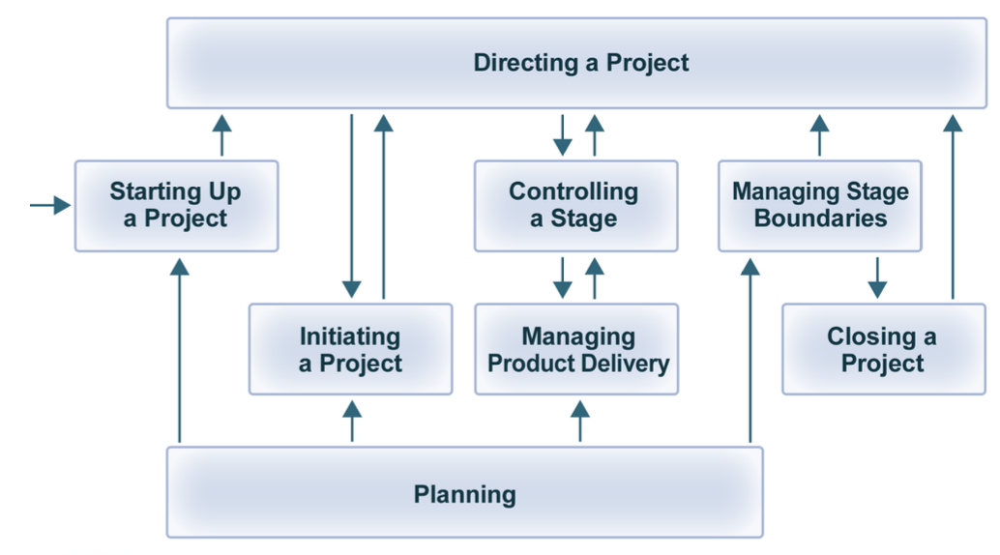
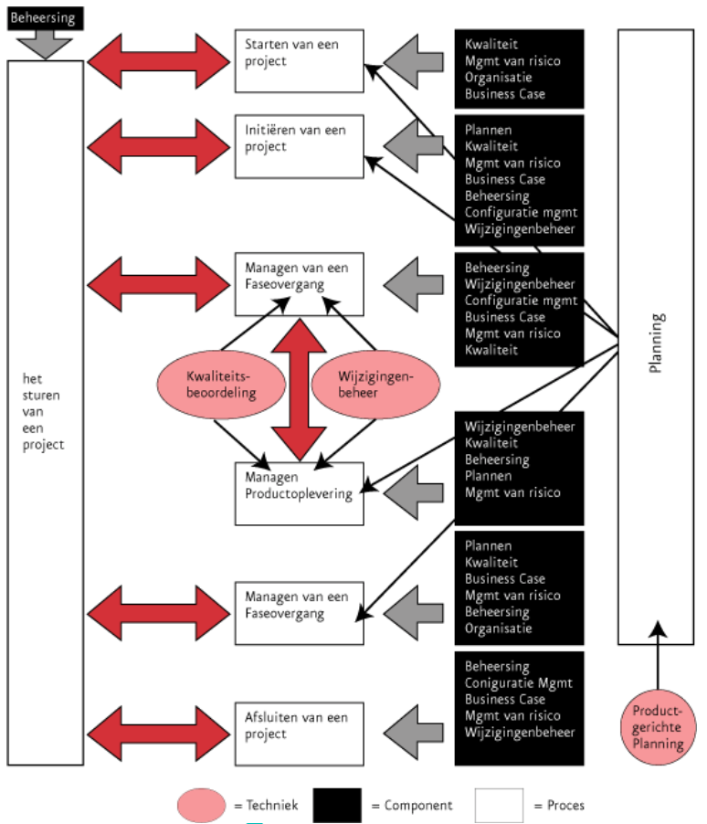

# Prince 2 

<!-- toc -->

 > **Pr**ojects **IN** **C**ontrolled **E**nvironments

 
 PRINCE2 is een methode voor projectmanagement. Deze methode is gericht op het management en de besturing en organisatie van een project. PRINCE2 is toepasbaar op alle projecten. Aspecten van de methode die niet van toepassingen zijn kunnen weggelaten worden.  De methode bestaat uit 7 principes, 7 thema's en 7 processen. De toepassing van de principes bepaald of iets een PRINCE2-project is, niet de strikte toepassing van de thema's of processen. 

 Een aantal kenmerken van Prince2 zijn:
 - Business Case
 - Client / Supplier
 - Non IT
 - Public domain
 - Best practice
 - Management by exception
 - Proces gericht
 - Product based planning
 - Geen ontwikkelingsfasering
 - Geen /weinig technieken
 
# Voordelen
## Algemeen
 - Herhaalbare methode
 - Methode die is te leren / over te brengen
 - Gebaseerd op ervaring
 - Zorgt er voor dat iedereen weet wat te verwachten, waar, hoe en wanneer
 - Vroegtijdig signalering van problemen
 - Is pro-actief en in staat om te gaan met plotselinge onverwachte situaties

## Voor de organisatie
- Beheerste manier van omgaan met wijzigingen met inachtneming van investeringen en ROI
- Actieve participatie van gebruikers en stakeholders gedurende het gehele project
- Een methode die onafhankelijk van het soort op te leveren producten te gebruiken is.

## Voor het project
- Beheerste start, uitvoering en afsluiting van het project.
- Frequente review van voortgang t.o.v. planning en Business Case
- Flexibele beslissingspunten.
- Afwijkingen van het plan worden 'automatisch' gesignaleerd.
- Betrokkenheid management en stakeholders op de juiste momenten tijdens het project.
- Goede communicatiekanalen tussen project, management team en de rest van de organisatie.
-  Overeenstemming over de gewenste **kwaliteit**

## Voor de projectmanager
- Heeft referentiekader voor de uitgangspunten met betrekking tot de start van het project
- Heeft een gedefinieerde structuur voor het delegeren, autoriseren en communiceren
- Kan het project opdelen in te managen 'stages voor beter planning
- Krijgt commitment van management voor in te zetten resources voordat de volgende  stage start
- Kan frequente managementrapportages opleveren
- Houdt vergaderingen met management en stakeholders tot het meest noodzakelijk beperkt

## Voor de gebruikers
- Duidelijke plaats in de projectorganisatie ten behoeve van beslissingen die genomen moeten worden
- Kunnen volledig betrokken zijn bij de dagelijkse voortgang
- Nemen deel in de quality checks gedurende het project
- Kunnen zeker stellen dat hun wensen ook daadwerkelijk worden uitgevoerd

## Voor senior management
- Management by exception
- Blijven volledig op de hoogte van status en voortgang

# Karakteristieken
- Eindig en vooraf gedefinieerde lifecycle
- Gedefinieerde en meetbare business producten
- Een overeenkomstige set activiteiten om die business producten te leveren
- Een gedefinieerde hoeveelheid resources
- Een organisatiestructuur met verantwoordelijkheden om het project te managen

# Aandachtsgebieden
- Organisation
- Plans
- Control
- Business Case
- Risk
- Quality
- Configuration Management
- Change Control

# Technieken
- Product Base Planning -- identificeer alle producten van het project om het doel te behalen en het werk dat daarvoor nodig is.
	- Product Breakdown Structure 
	- Product Flow Diagram
- Change Control
- Quality Review
- Project Document Management
	- Management Files
	- Specialist Files

# Producten 
- Product Outline:
	- Templates voor verschillende op te leverne management producten
	- Productbeschrijvingen

# Principes
* Zorg constant voor zakelijke rechtvaardiging
	* Gedurende het project een valide reden. De redenen worden getoetst aan de 'Business Case' die voortdurend geactualiseerd wordt. Voorkomen dat project doorgaat terwijl er geen baten meer te verwachten zijn.
* Leer van ervaringen
	* Er word een 'lessons log' bijgehouden om het volgend project ten dienste te zijn.
* Definieer de rollen en verantwoordelijkheden
	* Alle betrokkenen weten hun rol en de corresponderende verantwoordelijkheid van zichzelf en de overige projectleden
* Deel het project op in beheersbare stadia
	* Complexe taken verdelen in afzonderlijke management stadia die te maken hebben met project sturing en niet om technische realisatie.
* Escaleer alleen bij uitzonderingen
	* Interventie van hogehand alleen als toleranties worden overschreven. Dat word gedocumenteerd in een 'Exception Report' en de stuurgroep kan vragen om een 'Exception Plan'. Dit heet 'Manage by Exception'
* Plan en stuur de producten
	* Productvereisten bepalen het benodigde werk en niet andersom.
* Schaal de methode waar nodig
	* Laat methodes weg als ze niet relevant zijn voor het project.

# Thema's
Thema's verschaffen inzicht over hoe het project te beheersen. Hoe de principes in de praktijk kunnen worden toegepast. De 7 thema's zijn:
1. Houdt de **Business Case** geldig
	* Inzicht of het project nog zinnig en haalbaar is. Bij een negatieve business case kan de doelstelling minder ambitieus worden gemaakt of het project worden gestaakt.
2. Definieer vooraf de vereiste **kwaliteit** van de producten
	* Door de klant geformuleerde kwaliteitsverwachtingen via acceptatie criteria worden bereikt. 
3. Leg de **organisatie** vast in termen van rollen en verantwoordelijkheden.
	* Alle zaken worden vastgelegd en projectleden houden zich hieraan.
4. Maak **plannen**
	* Plan hoe doelen worden bereikt in termen van 
		* productbeschrijvingen
		* tijdsplanning
		* kosten
		* acceptatiecriteria
		* voordelen
5. Onderken de **risico's**
	* Het opsporen van risico's die het project bedreigen en beheersen.
	* Risico verminderende maatregelen te treffen i.p.v. eliminteren bijvoorbeeld backup maken
6. Overeenstemming van **veranderingen**
	* Alle potentiële wijzigingen worden behandeld als 'Project Issues'. Er zijn 3 soorten:
		* Wijzigingsvoorstellen
		* Afwijkingen van specificaties
		* Probleem of zorgpunt
7. Bewaak de **voortgang**
	* Managers worden op de hoogte gesteld van voortgang in relatie tot de planning. 

# Processen

 

* Starting Up a project (SU)
	* Project word voorbereid 
	* Management levert 'Project Mandaat'
	* Is het zinvol het project te beginnen?
	* 'Business Case' wordt globaal opgesteld.
	* 'Project Organisatie' word opgesteld
	* Project aanpak wordt gekozen
	* Dit word gedocumenteerd in 'Project Brief'
	* 'Project Brief' samen met plan eer	ste stadium overhandigd aan stuurgroep met verzoek om project te starten.

	* Wie betaalt
	* Wie bepaalt wat gedaan wordt
	* Wie neemt de beslissingen
	* Wie doet het werk
	* Wat is de fundamentele aanpak van dit project
	* Vastleggen van betrokkenen

| Input | Output |
| :------------ | :-----------: |
| Project Mandate | ProjectBrief |
|  | Initiation Stage Plan |
|  | Risk log |
|  | Project Management Team structure |
|  | Project Approach |
|  | Job descriptions |

	
	
* Initiating a Project (IP) 
	* De beoogde resultaten, plannen, taken en verantwoordelijkheden vastgelegd.
	* 'Business Case' word volledig uitgewerkt
	* Hieruit komt voor 'Project initiation Document'
* Directing a Project (DP)
	* Stuurgroep verleent autorisaties en oordeelt en stuurt in geval van uitzonderingen
* Controlling a Stage (CS)
	* Project word opgedeeld in stadia
	* Deelproducten worden vervaardigd binnen de afgesproken grenzen van tijd, kwaliteit, risico en budget
* Managing a Stage Boundary (SB)
	* Activiteiten die de projectmanager onderneemt om de stuurgroep van voldoende informatie te voorzien om het huidige stadium te beoordelen. Het plan voor volgend stadium goed te keuren en de levensvatbaarheid van het project te beoordelen.
* Managing Product Delivery (MP)
	* Oplevering van deelproducten. 
	* Werkpakketten worden uitgegeven door het 'CS' stadium. 
* Closing a Project (CP)
	* Project word afgesloten
	* Aanbeveling word gedaan de stuurgroep met een 'End Project Report', PID en rapportage van leermomenten. 

# Samengevat

