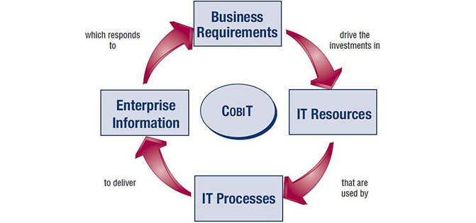
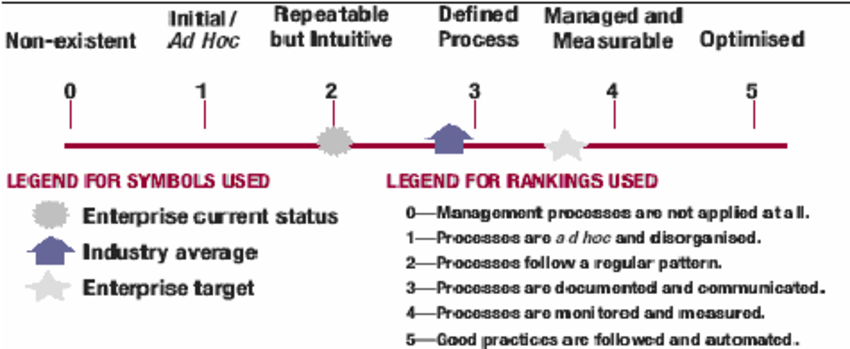

<!-- toc -->

# Auditing  

> Audit is geven van een oordeel door middel van toetsing aan een norm

of

> Audit is onderzoek naar een object, da t leidt tot een oordeel omtrent een of meer aspecten met betrekking tot dit object

Het doel van een audit is het reduceren van onzekerheid/verschaffen van zekerheid

Het resultaat van een audit zijn bevindingen en aanbevelingen. 

Auditobjecten:
* Producten
* Processen
* Structuur
* Middelen
* Applicaties
* IT organisatie
* Documentatie
* Besturingsprogrammatuur
* Hardware
* Procedures

Aspecten -- de invalshoek bij het bepalen van de kwaliteit van het auditobject
* Betrouwbaarheid
* Continuïteit
* Vertrouwelijkheid
* Effectiviteit
* Efficiëncy

Normen:
* Wetgeving
* Finanical auditing
* Geaccepteerde vakgebieden
* Code voor Informatiebeveiliging
* ITIL
* COBIT

> Scope van audit is object + aspect + normen. Toetsing van opzet, bestaan en werking

Het universele auditproces
* Vaststellen doelstelling
* Opdrachtacceptatie
* Vaststellen SOLL
* Vaststellen IST
* Vaststellen IST en SOLL
* Evalueren verschillen
* Rapporteren

# Auditplan

> Plan van aanpak voor audit. 

Beschrijving van: 
* De uit te voeren activiteiten
* Doelstelling
* Probleemstelling
* Opdrachtomschrijving
* Omgevingsfactoren
* Context
* Scope
* Methoden
* Technieken
* Hulpmiddelen

# COBIT

> **C**ontrol **OB**jectives for **I**nformation and related **T**echnology

COBIT is een framework van best practices voor het gestructureerd inrichten en beoordelen van een IT-beheeromgeving. Deze practices zijn gefocust op beheer en niet op uitvoering. Auditors kunnen op basis van het framework hun controleprogramma beschrijven en uitvoeren. 

Bij COBIT vallen de activiteiten binnen 4 domeinen:
* Plan and Organise -- Dit domein gaat over tactieken en strategie en betreft het identificeren hoe IT het beste kan bijdragen aan het halen van de bedrijfs doelen. 
	* Hoe kan IT bijdragen aan de business strategy?
	* Word er optimaal gebruik gemaakt van de middelen?
	* Begrijpt iedereen in de organisatie de IT doelen?
	* Worden de IT risico's begrepen en beheerd?
	* Is de kwaliteit van IT systemen geschikt voor de bedrijfsbenodigheden?
* Acquire and Implement -- Om de IT strategy te realiseren moeten IT oplossingen worden geïdentificeerd, ontwikkeld en verworven, maar ook geïmplementeerd en geïntegreerd in het bedrijfsproces. Veranderingen en onderhoud bij bestaande systemen hoort ook bij dit domein. 
	* Passen de oplossingen van de projecten bij behoeftes van het bedrijf?
	* Worden de nieuwe projecten opgeleverd binnen de afgesproken tijd en budget?
	* Werken de nieuwe systemen naar behoren wanneer geïmplementeerd?
	* Storen de veranderingen niet bij de huidige bedrijfs operaties?
* Deliver and Support -- In dit domein betreft het leveren van services, management van security en continuiteit, service support voor gebruikers en management van data en operationele facitiliteiten.
	* Zijn de geleverde IT services in lijn met de bedrijfs prioriteiten?
	* Zijn de IT kosten geoptimaliseerd?
	* Kunnen de IT systemen productief en veilig gebruikt worden door de werkgroep?
	* Zijn passende vertrouwlijkheid, integriteit en beschikbaarheid op zijn plaats?
* Monitor and Evaluate -- Alle IT processen moeten regelmatig worden geëvalueerd over de kwaliteit en de meegaandheid met control vereisten. Dit domein betreft prestatie management, toezicht houden op interne controles, naleving van regelgeving en verstrekken van bestuur.
	* Worden IT prestaties gemeten om problemen te detecteren?
	* Zorgt management ervoor dat interne controles effectief en efficient zijn?
	* Kan IT performance worden terug gelinked naar bedrijfs doelen?
	* Zijn risico, controle, meegaanheid en prestatie gemeten en gerapporteerd?

## Controls based
> *Proccesses need Controls*. Controlles zijn het beleid, de procedures, de praktijken en de structuren ontworpen om een redelijke zekerheid te geven dat de bedrijfs doelen worden behaald en ongewenste gebeurtenisen worden voorkomen of gedetecteerd en 

> Een IT controle doel is een statement van het gewenste resultaat of doel dat behaald word door het implementeren van controle procedures in een specifieke IT activiteit. COBIT's controle doelen zijn minimale eisen om effectieve controle te behalen in elk IT process.

## Maturity model
